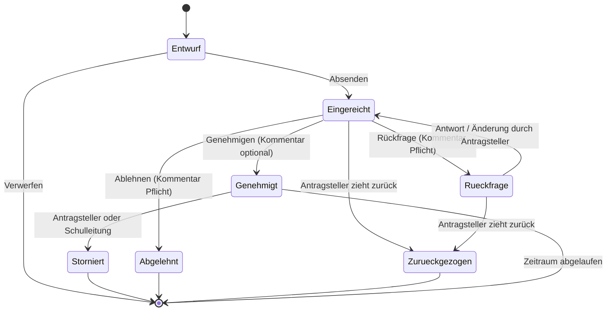

# 00 — Entscheidungsprotokoll

Laufendes Protokoll der gemeinsam getroffenen Entscheidungen. **Dieses Dokument ist
maßgeblich.** Die Dokumente 01–05 sind der ursprüngliche Entwurf mit Annahmen; sie werden
nach Abschluss der fachlichen Schritte (1–6) auf diesen Stand gebracht.

---

## Schritt 1 — Beteiligte und Rollen · *entschieden*

### E-1.1 Entscheidungsbefugnis
**Die Schulleitung entscheidet allein und standortübergreifend.** Keine Vorprüfung durch
Abteilungs- oder Standortleitungen, keine zweite Genehmigungsstufe.
→ Ein Antrag = eine Entscheidung.

### E-1.2 Vertretung der Schulleitung
**Die stellvertretende Schulleitung erhält dieselben Entscheidungsrechte**, nutzt sie aber
nur bei Abwesenheit der Schulleitung.

*Umsetzungshinweis:* Technisch ist das **eine** Rolle mit Entscheidungsrecht, die zwei
Personen innehaben. Eine Ein-/Ausschaltmechanik („Vertretungsmodus") wird bewusst **nicht**
gebaut — sie erzeugt genau dann Reibung, wenn sie gebraucht wird (die Schulleitung ist
krank und kann den Modus nicht mehr aktivieren). Stattdessen: Beide sehen den Arbeitsvorrat,
die Absprache wer entscheidet ist eine organisatorische, keine technische.

*Folge für die Übersicht:* Jeder Antrag zeigt sichtbar, **wer** entschieden hat.

### E-1.3 Vertretungs-/Stundenplanung — *korrigiert durch E-5.7*

> **Diese Entscheidung ist überholt.** Es gibt **je Standort eine eigene
> Stundenplanung**, nicht eine zentrale für beide. Siehe **E-5.7**.
> Der ursprüngliche Wortlaut bleibt zur Nachvollziehbarkeit stehen.

### E-1.3 (ursprünglich) Vertretungs-/Stundenplanung
**Eine Person für beide Standorte.**

*Wesentliche Vereinfachung:* Damit ist der Standort für die Stundenplanung kein
Verteilkriterium, sondern nur **Inhalt** der Meldung (welche Lerngruppen an welchem Haus).
Die Standortweiche wirkt nur noch beim Sekretariat (E-1.4).

*Risiko, das dadurch entsteht:* Auch hier hängt eine Funktion an einer einzelnen Person.
Die Benachrichtigung geht deshalb an ein **Rollenpostfach**, nicht an eine persönliche
Adresse, und die Übersicht genehmigter Abwesenheiten ist auch für die Schulleitung
einsehbar — damit bei Ausfall jemand übernehmen kann.

### E-1.4 Sekretariat — *aufgehoben durch E-5.5*

> **Diese Entscheidung ist überholt.** Die Sekretariate werden gar nicht beteiligt,
> weil sie die Abwesenheiten ohnehin im Stunden-/Vertretungsplan sehen. Siehe **E-5.5**.
> Der ursprüngliche Wortlaut bleibt zur Nachvollziehbarkeit stehen.

### E-1.4 (ursprünglich) Sekretariat
**Zwei Sekretariate, je Standort eines.** Aufgabe im Workflow: **ausschließlich
Kenntnisnahme** — wissen, wer wann nicht im Haus ist (Telefon, Besucher, Auskunft).
Keine Kostenabwicklung, keine Veranstaltungsorganisation über dieses System.

*Folge — sehr geringer Datenbedarf:* Das Sekretariat erhält nur
**Name · Zeitraum · Standort · Antragsart**. Kein Anlass, keine Lerngruppen, keine Stunden,
keine Kommentare, keine Kosten. Das ist die schlankeste Sicht im ganzen System.

*Dies ist die einzige Stelle, an der die Standortauswahl den Empfängerkreis steuert.*

### E-1.5 Antragsberechtigte
**Lehrkräfte und Lehrkräfte im Vorbereitungsdienst.** Verwaltungspersonal, Hausmeisterei
und weiteres Personal bleiben zunächst im bisherigen Verfahren.

### Rollenübersicht nach Schritt 1

| Rolle | Anzahl | Standortbindung | Rechte |
|---|---|---|---|
| Antragstellende Person | alle Lehrkräfte + LiV | — | eigene Anträge stellen, ergänzen, zurückziehen, stornieren |
| Schulleitung | 1 | keine (beide Standorte) | entscheiden, alle Anträge sehen |
| Stellvertretende Schulleitung | 1 | keine | identisch — für Abwesenheitsfälle |
| Vertretungsplanung | **2** | **je Standort** | genehmigte Abwesenheiten des eigenen Standorts in reduzierter Sicht (korrigiert, E-5.7) |
| ~~Sekretariat~~ | — | — | *entfällt vollständig, siehe E-5.5* |
| Administration | 1–2 | — | Benutzer/Stammdaten, kein Zugriff auf Antragsinhalte |

### Offen aus Schritt 1 — später zu klären

* **O-1.1** Wer wickelt Reisekosten und Busbestellungen ab, wenn nicht das Sekretariat?
  Läuft das ganz außerhalb des Systems? (→ relevant in Schritt 2 bei Fortbildungen und Fahrten)
* **O-1.2** Sonderfall Vorbereitungsdienst: Bei Lehrkräften im Vorbereitungsdienst ist neben
  der Schule ggf. das Studienseminar zu beteiligen. Braucht der Workflow dafür etwas —
  oder bleibt das ein Vorgang außerhalb des Systems? (→ Schritt 4)
* **O-1.3** Wer übernimmt die Administration (Benutzerverwaltung, Stammdaten)? (→ Schritt 8)

---

## Schritt 2 — Antragsarten und Startumfang · *in Arbeit*

### E-2.1 Antragsarten im Endausbau
Bestätigt sind alle vier Arten des Entwurfs:

| Art | Bezeichnung | Kern |
|---|---|---|
| **A** | Dienstbefreiung | eine Person, persönlicher Anlass |
| **B** | Fortbildung / Dienstreise | eine Person, dienstlicher Anlass, Kostenbezug |
| **C** | Unterrichtsgang / Exkursion | Lerngruppen + Begleitpersonen, eintägig |
| **D** | Mehrtägige Fahrt / Großveranstaltung | wie C, zusätzlich Übernachtung, Kosten, Beschlusslage |

**Offen:** Die antragstellende Person hat auf ein bestehendes Dokument mit weiteren
Antragsarten verwiesen („siehe Anhang"). Das Dokument liegt noch nicht vor.
→ Liste ist bis dahin **nicht abschließend**.

### E-2.2 Startumfang Stufe 1
**Dienstbefreiung (A) + Unterrichtsgang (C).**

*Begründung:* A und C sind die beiden Gegenpole des Datenmodells — eine Person ohne
Lerngruppenbezug gegenüber ganzen Lerngruppen mit Begleitpersonen und Vertretungsbedarf.
Trägt das Konzept beide, sind B und D im Wesentlichen Varianten davon (B ≈ A mit Kosten,
D ≈ C mit Übernachtung).

*Folge für die Umsetzung:* Die Struktur für **betroffene Lerngruppen, Begleitpersonen und
Vertretungsbedarf** gehört in Stufe 1, nicht in eine Ausbaustufe. Sie nachträglich
einzuziehen wäre der teuerste denkbare Umbau.

### E-2.3 Bestehende Formulare sind Vorlage, nicht Beiwerk
An der Schule existieren **eigene, eingeführte Papierformulare**. Die digitalen Formulare
werden daran ausgerichtet: gleiche Felder, gleiche Reihenfolge, gleiche Bezeichnungen.

*Begründung:* Vertraute Formulierungen senken die Einführungshürde stärker als jede
Schulung. Abweichungen erfolgen nur mit konkretem Grund und werden einzeln begründet —
typischerweise: Pflichtfeld statt leer lassbarer Zeile, Auswahlliste statt Freitext
(Datenschutz), neue Standortauswahl.

### Offen aus Schritt 2
* **O-2.1** Bestehende Formulare liegen noch nicht vor → Feldabgleich ausstehend (Schritt 6)
* **O-2.2** Weitere Antragsarten aus dem angekündigten Dokument prüfen

---

## Schritt 2 — *abgeschlossen*

### E-2.4 Ausgangslage des vorhandenen Prototyps
* **Nur die Oberfläche existiert**, kein Backend hinter `/api/antrag`; Schulleiter-Ansicht
  und Archiv sind Platzhalter.
* Erstellt vom Auftraggeber selbst mit KI-Unterstützung; Pflege ebenfalls dort.
* Läuft bisher **nur lokal**, nicht erreichbar, **keine echten Daten**.

**Folge — der günstigste denkbare Zeitpunkt:** Anmeldung, Berechtigungen, Löschkonzept und
Datenschutzhinweis können eingebaut werden, *bevor* der erste echte Antrag existiert.
Keine Migration, keine Altdaten, kein Umbau im laufenden Betrieb.

**Folge für die Technologiewahl (Q-04):** Das System hängt an einer Person. Daraus folgt
kein Abbruch, aber ein Kriterium: **Standardtechnologie und gute Dokumentation vor
eleganter Lösung** — damit im Vertretungsfall jemand anderes übernehmen kann. Wird in
Schritt 8 als Entscheidungskriterium geführt.

---

## Schritt 3 — Standortlogik · *entschieden*

Ausgangsproblem: Im Prototyp erscheint „An beiden Standorten" nur im Zeitraum-Zweig und
kennt nur „beide" — bei einem Einzeltag ist der Standort gar nicht angebbar, und bei nicht
gesetzter Checkbox bleibt offen, *welcher* Standort gemeint ist.

### E-3.1 Form der Angabe
**Pflichtauswahl mit drei Möglichkeiten, sichtbar in beiden Zweigen** (Einzeltag *und*
Zeitraum):

```
Betroffener Standort *     ○ Runkel     ○ Villmar     ○ Beide Standorte
```

Sobald eine Anmeldung existiert, wird der Stammstandort vorbelegt — als Vorschlag,
immer änderbar.

### E-3.2 „Beide" ist bei Einzeltagen ein Regelfall, kein Sonderfall
Lehrkräfte unterrichten **regelmäßig an einem Tag an beiden Standorten**. Die Auswahl
„Beide" muss daher auch beim Einzeltag zur Verfügung stehen.

**Keine Aufteilung der Stunden je Standort.** Die Standortangabe beantwortet nur die Frage
*„in welchem Haus fehlt diese Person?"* — sie steuert damit das Sekretariat. Welche Stunde
an welchem Haus liegt, ergibt sich aus dem Stundenplan und ist der Vertretungsplanung
ohnehin bekannt. Ein zweites Stundenfeld je Standort würde das Formular verkomplizieren,
ohne eine Frage zu beantworten, die jemand tatsächlich hat.

### E-3.3 Standortangabe ist auch bei Unterrichtsgängen zwingend — *korrigiert*

> **Korrektur.** Eine frühere Fassung dieses Punktes sah vor, den Standort bei Antragsart 2
> automatisch aus den gewählten Lerngruppen abzuleiten. Das ist **nicht möglich:**
> An beiden Standorten existieren **gleichlautende Lerngruppenbezeichnungen**.

**„9b" identifiziert keine Lerngruppe.** Eindeutig ist erst das Paar
**Standort + Bezeichnung** — also `9b (Runkel)` gegenüber `9b (Villmar)`.

Daraus folgt für **alle** Antragsarten: Die Standortauswahl aus E-3.1 ist eine
**Pflichtangabe und wird nirgends abgeleitet.**

### E-3.4 Lerngruppen als Freitextfeld — *Entscheidung des Auftraggebers*

Die Lerngruppen werden **frei eingetragen**, nicht aus einer Liste gewählt.

**Begründung (maßgeblich):**
1. Mal ist eine einzelne Lerngruppe betroffen, mal mehrere — Freitext bildet beides ohne
   Umschweife ab.
2. **Eine gepflegte Lerngruppenliste müsste jedes Schuljahr angepasst werden.** Das ist
   wiederkehrender Aufwand, der bei einem von einer Person betriebenen System
   erfahrungsgemäß irgendwann unterbleibt — und eine veraltete Liste ist schlechter als
   gar keine, weil man ihr vertraut.

**Warum das tragfähig ist:** Der eigentliche Grund für eine Liste war die Verwechslung
gleichnamiger Lerngruppen beider Standorte. Dieses Problem löst bereits das **Pflichtfeld
Standort** aus E-3.1. `9b` im Freitext zusammen mit `Runkel` im Auswahlfeld ist
ebenso eindeutig wie ein Listeneintrag.

```
Betroffener Standort *   ○ Runkel   ○ Villmar   ○ Beide Standorte
Betroffene Lerngruppen * [ 9b, 10a                                      ]
                           Vorschläge erscheinen beim Tippen
```

### E-3.5 Selbstlernende Vorschläge statt gepflegter Liste

Das Feld ist Freitext, schlägt aber beim Tippen Werte vor, **die bereits in früheren
Anträgen vorkamen** (im laufenden Schuljahr, am gewählten Standort).

*Der Punkt daran:* Die Vorschlagsliste entsteht von selbst aus dem, was das Kollegium
einträgt, und veraltet von selbst mit dem Schuljahreswechsel. **Niemand pflegt sie.**
Nach wenigen Wochen wirkt sie wie eine gepflegte Lerngruppenliste, ohne je eine geworden zu
sein. Wer etwas Neues eintippt, wird nicht gehindert — Vorschlag, keine Vorschrift.

Zusätzlich beim Speichern: stille Normalisierung (Leerzeichen zusammenfassen, Trennzeichen
vereinheitlichen). **Keine Prüfung, keine Ablehnung, keine Fehlermeldung** — das Feld darf
niemanden aufhalten.

### E-3.6 Was wir dafür aufgeben

Ehrlich benannt, damit es später keine Überraschung ist:

| Entfällt | Bedeutung |
|---|---|
| Automatischer Konflikthinweis („für 9b liegt am selben Tag bereits ein Unterrichtsgang vor") | War als SOLL geplant, nicht als MUSS. Freitext lässt sich nicht zuverlässig vergleichen. |
| Auswertung nach Lerngruppen | Etwa „wie viele Unterrichtsgänge hatte die 9b". Aggregierte Kennzahlen je Antragsart und Standort bleiben möglich. |
| Einheitliche Schreibweise | `9b`, `9 b`, `9B` stehen nebeneinander. Die Normalisierung mildert das, beseitigt es nicht. |

Die Anzeigeregel bleibt bestehen: Lerngruppen werden **immer zusammen mit dem Standort**
des Antrags ausgegeben — in Übersichten, im Archiv und in Benachrichtigungen. Nie nur „9b".

### E-3.7 Sprachregelung: „Lerngruppe", nicht „Klasse"

Durchgängig in Formular, Oberfläche, Benachrichtigungen und allen Dokumenten heißt es
**Lerngruppe**.

*Grund:* „Klasse" trifft nur einen Teil der Fälle. Betroffen sind ebenso Kurse,
jahrgangsübergreifende Gruppen, Fachgruppen und Teilgruppen — die Bezeichnung muss alles
davon selbstverständlich einschließen, statt es als Sonderfall erscheinen zu lassen.

Feste Begriffe („Klassenfahrt", „Klassenkonferenz") bleiben davon unberührt.

### Wirkung der Standortangabe — Zusammenfassung

| Empfänger | Wirkt der Standort? |
|---|---|
| Schulleitung | nein — entscheidet standortübergreifend (E-1.1) |
| Vertretungsplanung | nein als Verteilkriterium — eine Zuständigkeit für beide Häuser (E-1.3); der Standort ist dort **Inhalt** und zur Unterscheidung gleichnamiger Lerngruppen unverzichtbar |
| **Sekretariat** | **ja** — bestimmt, welches der beiden Sekretariate informiert wird (E-1.4) |

Die Standortauswahl hat damit genau **einen** verteilungsrelevanten Zweck. Das ist wenig —
aber es ist der Grund, warum die Angabe eindeutig sein muss und nicht als „beide ja/nein"
genügt.

### E-3.8 Die Standorte heißen Runkel und Villmar

Im Formular, in allen Übersichten und in Benachrichtigungen werden die Standorte
**mit ihrem Ortsnamen** bezeichnet — nie als „Standort A/B", „Haupt-/Nebenstelle" oder
über ein Kürzel:

```
Betroffener Standort *   ○ Runkel   ○ Villmar   ○ Beide Standorte
```

*Warum das mehr ist als Kosmetik:* Ortsnamen sind selbsterklärend und werden im Kollegium
ohnehin verwendet. Eine künstliche Bezeichnung müsste jede neue Kollegin erst lernen, und
bei einer Auswahl, die über den Empfänger einer Benachrichtigung entscheidet, ist jede
Bedenksekunde eine Fehlerquelle.

Reihenfolge alphabetisch (Runkel vor Villmar), ohne Vorbelegung, solange es keine
Anmeldung mit Stammstandort gibt. Für die Sekretariate gilt entsprechend
„Sekretariat Runkel" und „Sekretariat Villmar".

### Schritt 3 — keine offenen Punkte

---

## Schritt 4 — Workflow und Status · *in Arbeit*

### E-4.1 Keine Fristenprüfung
An der Schule gelten **keine verbindlichen Antragsfristen**, das läuft informell.

**Folge:** Die im Entwurf vorgesehene Fristprüfung entfällt vollständig —
Anforderung **F-13 wird gestrichen**. Kein Regelvorlauf je Antragsart, kein Pflichtfeld
„Begründung der verspäteten Antragstellung", keine Warnung beim Absenden.

**Gestaltungsgrundsatz, der daraus folgt:** Das System **mahnt die antragstellende Person
nicht**. Keine roten Hinweise, kein „Sie hätten früher fragen müssen", keine Bewertung des
Zeitpunkts. Ein kurzfristiger Antrag ist ein normaler Antrag. Ob er zu spät kam,
entscheidet die Schulleitung im Einzelfall — nicht eine Regel im Formular.

**Was davon unberührt bleibt**, weil es nicht die antragstellende Person betrifft, sondern
die Entscheidung:

| Bleibt | Begründung |
|---|---|
| Arbeitsvorrat der Schulleitung **sortiert nach Beginn des Zeitraums**, nicht nach Eingang (F-08) | Was zuerst stattfindet, muss zuerst entschieden werden — unabhängig davon, wann es beantragt wurde |
| Erinnerung an die Schulleitung, wenn ein noch offener Antrag bald beginnt | Richtet sich an die Entscheidungsebene, nicht an die antragstellende Person. Verhindert, dass ein Antrag unentschieden verfällt |

Der Unterschied ist wesentlich: Es gibt keine Frist für das *Stellen* eines Antrags —
wohl aber ein Interesse daran, dass ein gestellter Antrag rechtzeitig *entschieden* wird.

### E-4.2 Kommentarpflicht bei Ablehnung — und bei Rückfrage
**Ablehnen ist ohne Begründung nicht möglich.** Der Knopf bleibt gesperrt, solange das
Kommentarfeld leer ist.

Ausgedehnt auf die **Rückfrage**: Eine Rückfrage ohne Frage ist sinnlos, also ebenfalls
Pflichttext. **Genehmigen bleibt kommentarfrei möglich** — das ist der Normalfall und soll
in einem Klick erledigt sein.

| Aktion | Kommentar |
|---|---|
| Genehmigen | optional |
| Ablehnen | **Pflicht** |
| Rückfrage | **Pflicht** |

*Folge für die Sichtbarkeit:* Eine Ablehnungsbegründung ist eine bewertende Aussage über
eine Beschäftigte oder einen Beschäftigten. Sie geht ausschließlich an die antragstellende
Person und bleibt bei der Schulleitung. **Vertretungsplanung und Sekretariat erfahren von
einem abgelehnten Antrag nichts** — auch nicht, dass es ihn gegeben hat. Informiert wird
erst ab der Genehmigung.

### E-4.3 Stornieren dürfen beide — antragstellende Person und Schulleitung
Wer zuerst erfährt, dass ein genehmigter Termin platzt, meldet es. Eine Absage ist eine
Tatsache, keine Bitte: Die Schulleitung kann einer Stornierung nicht widersprechen,
sie wird informiert.

Die Stornierung löst dieselbe Benachrichtigungskette aus wie die Genehmigung, an alle
zuvor Informierten. **Das ist die wichtigste Einzelfunktion des ganzen Systems** — eine
Abwesenheit, die doch nicht stattfindet, muss die Vertretungsplanung ebenso zuverlässig
erreichen wie die ursprüngliche Zusage.

Drei Festlegungen dazu:

* **Stornieren ist kein Löschen.** Der Vorgang bleibt mit Status *storniert* erhalten,
  einschließlich der Angabe, wer storniert hat. Ohne diese Spur bliebe unerklärlich,
  warum eine gemeldete Abwesenheit wieder verschwand.
* **Keine Begründungspflicht.** Ein geplatzter Termin muss nicht gerechtfertigt werden;
  ein optionales Feld genügt.
* **Möglich bis zum Ende des beantragten Zeitraums.** Danach nicht mehr — eine nachträgliche
  Stornierung hilft niemandem und würde die Übersicht verfälschen.

### E-4.4 Rückfrage als Dialog am Vorgang
Die Schulleitung schreibt ihre Frage, die antragstellende Person antwortet darunter.
**Alles bleibt am Vorgang sichtbar**, in einem fortlaufenden Verlauf — keine E-Mail-Kette,
kein Zurücksetzen des Antrags.

*Der entscheidende Vorteil:* Übernimmt die stellvertretende Schulleitung (E-1.2), ist der
gesamte Gesprächsstand ohne Nachfragen lesbar. Bei einer Zurückweisung zum Überarbeiten
wäre die Vorgeschichte verloren.

**Der Antrag bleibt während der Rückfrage bearbeitbar.** Viele Rückfragen laufen auf
„bitte die Stunden ergänzen" hinaus — dann soll man das Feld ändern können, statt es im
Kommentar zu beschreiben. Jede Änderung erscheint als Eintrag im selben Verlauf
(„Stunden geändert: 1–3 → 1–4"), sodass die Schulleitung sofort sieht, was passiert ist.

Kommentare sind nach dem Absenden **nicht editierbar** — ein nachträglich geänderter
Verlauf wäre wertlos. Der Verlauf ist sichtbar für die antragstellende Person und die
Entscheidungsebene, für niemanden sonst.

### E-4.5 Änderung eines genehmigten Antrags: stornieren und neu stellen
Der Entwurf sah einen eigenen Status *Geändert* mit erneuter Entscheidung vor
(Anforderung F-16). **Der entfällt.**

Stattdessen: „Antrag ändern" storniert den bestehenden Vorgang und öffnet einen neuen,
mit den Werten des alten vorbelegt. Ein Klick für die antragstellende Person, und der
neue Antrag durchläuft den gewöhnlichen Weg.

*Warum das besser ist:* Ein Status weniger, ein Sonderfall weniger in den
Benachrichtigungen — und die Vertretungsplanung bekommt zwei klare Meldungen
(„fällt weg", „kommt neu") statt einer Änderungsmeldung, die sie mit dem alten Stand
abgleichen müsste. Der Zusammenhang bleibt über einen Verweis auf den Vorgängervorgang
erhalten.

### Statusmodell nach Schritt 4



Sieben Zustände, keine Nebenwege, keine automatischen Übergänge außer dem Ablauf des
Zeitraums. **Es gibt keine Genehmigung durch Zeitablauf** — eine Genehmigung ist eine
Entscheidung, nicht das Ausbleiben einer Entscheidung.

### Schritt 4 — keine offenen Punkte

---

## Schritt 5 — Benachrichtigungen · *Vorschlag, zur Bestätigung*

### E-5.1 Vertretungsplanung: Einzelmeldung sofort — und die Liste als Arbeitsgrundlage

**Keine Tageszusammenfassung.** Jede Genehmigung und jede Stornierung erzeugt sofort eine
kurze Meldung.

*Begründung:* Eine Sammelmail löst ein Mengenproblem. Bei einer Schule dieser Größe
entstehen pro Tag einzelne, nicht dutzende Vorgänge — das Problem existiert also noch
nicht, während der Nachteil sofort wirkt: Ein um 16 Uhr genehmigter Antrag für den nächsten
Morgen darf nicht bis zum nächsten Sammellauf liegen bleiben. Sollte sich die Menge als
störend erweisen, ist eine Zusammenfassung jederzeit nachrüstbar — die umgekehrte Richtung
wäre der teurere Weg.

**Wichtiger als die Mail ist aber die Festlegung dahinter:** Die Vertretungsplanung arbeitet
**nicht aus dem Postfach**, sondern aus der Liste im System. Die E-Mail ist ein Wecker, kein
Arbeitsmittel. Eine übersehene Mail darf nie bedeuten, dass eine Vertretung fehlt — in der
Liste steht alles, auch das, was im Postfach untergegangen ist.

### E-5.2 Sekretariate werden nicht beteiligt — *ersetzt durch E-5.5*

Siehe **E-5.5**: weder E-Mail noch Tagesliste, die Rolle entfällt vollständig.

### E-5.3 Eingangsbestätigung: ja

Die antragstellende Person erhält eine kurze Bestätigung per E-Mail, dass der Antrag
eingegangen ist — mit Vorgangsnummer und Link, ohne inhaltliche Angaben.

*Begründung:* Die Frage „ist das überhaupt angekommen?" ist in der Einführungsphase eines
neuen Verfahrens die häufigste. Ohne Bestätigung wird sie per Mail an die Schulleitung
gestellt — also genau der Weg, den das System ersetzen soll. Eine Zeile E-Mail verhindert
das.

### Benachrichtigungsmatrix — Stand Schritt 5

**✉** = E-Mail · **○** = im System sichtbar · **—** = keine Information

| Ereignis | Antragsteller | Schulleitung | Vertretungsplanung |
|---|---|---|---|
| Antrag eingereicht | ✉ Eingangsbestätigung | ✉ | — |
| Rückfrage gestellt | ✉ | ○ | — |
| Rückfrage beantwortet | ○ | ✉ | — |
| **Genehmigt** | ✉ | ○ | ✉ |
| Abgelehnt | ✉ | ○ | — |
| Zurückgezogen (vor Entscheidung) | ○ | ✉ | — |
| **Storniert** | ✉ | ✉ | ✉ |
| Erinnerung: offener Antrag beginnt bald | — | ✉ | — |

Wer storniert, bekommt darüber keine Mail — nur die jeweils andere Seite (E-4.3).

### E-5.4 Inhalt jeder E-Mail
Unverändert gültig aus dem Datenschutzkonzept: **Vorgangsnummer, Antragsart, Ereignis,
Link.** Kein Anlass, kein Kommentartext, keine Lerngruppen, keine Namen Dritter.

> Antrag DB-2026-0147 (Dienst-/Unterrichtsbefreiung) wurde genehmigt.
> Details im System: <Link>

Die einzige Ausnahme ist die Meldung an die Vertretungsplanung, die Name, Zeitraum und
Standort benötigt, um überhaupt nützlich zu sein. **Auch sie nennt keinen Anlass.**
Ob selbst das noch in eine E-Mail gehört oder besser nur als Hinweis „es gibt Neues in
der Liste" verschickt wird, ist in Schritt 7 mit dem Datenschutzbeauftragten zu prüfen.

### E-5.5 Die Sekretariate entfallen vollständig

**Weder E-Mail noch Tagesliste. Die Sekretariate sind keine Rolle im System.**

*Begründung:* Die Abwesenheiten erscheinen ohnehin im Stunden- bzw. Vertretungsplan, den
die Sekretariate einsehen. Eine zweite Quelle für dieselbe Information wäre nicht nur
überflüssig, sondern schädlich — zwei Listen, die auseinanderlaufen können, und die Frage,
welcher man glaubt.

### Tragweite dieser Entscheidung

Sie ist die weitreichendste Vereinfachung des bisherigen Konzepts:

| Entfällt | Folge |
|---|---|
| Rolle „Sekretariat" | Von sechs Rollen bleiben vier: Antragsteller, Schulleitung (mit Stellvertretung), Vertretungsplanung, Administration |
| Zwei Benutzerkonten bzw. Rollenpostfächer | Weniger Zugänge, weniger Rechtevergabe, weniger Angriffsfläche |
| Ansicht „Heute abwesend" je Standort | Eine Oberfläche weniger zu bauen und zu pflegen |
| ~~Standortbezogene Berechtigungsprüfung~~ | **entfällt doch nicht** — sie wird für die beiden Stundenplanungen weiterhin gebraucht (E-5.7) |
| Zwei Benachrichtigungswege | Die Matrix hat nur noch drei Empfänger |

~~**Kein Empfänger im System hängt mehr vom Standort ab.**~~ — *Diese Schlussfolgerung war
falsch und wird durch **E-5.7** aufgehoben:* Die Vertretungsplanung gibt es zweimal,
je Standort einmal, und ist damit standortabhängig.

### E-5.6 Begründung für das Standortfeld — *erledigt durch E-5.7*

> Die hier gestellte Frage, ob das Standortfeld bei Antragsart 1 entfallen könnte, ist
> beantwortet: **nein.** Mit zwei Stundenplanungen steuert es wieder einen Empfänger.

### E-5.6 (ursprünglich) Damit ändert sich die Begründung für das Standortfeld

Das Feld bleibt, aber sein Zweck ist ein anderer als in E-3.1 angenommen. Es steuert
**keinen Empfänger mehr**, sondern dient nur noch dem Inhalt:

| Antragsart | Zweck des Standortfelds | Bewertung |
|---|---|---|
| **2 — Unterrichtsgang / Veranstaltung** | Unterscheidet gleichnamige Lerngruppen beider Standorte (E-3.4/E-3.7) | **unverzichtbar** |
| **1 — Dienst-/Unterrichtsbefreiung** | Zeigt auf einen Blick, in welchem Haus die Person fehlt | nützlich, aber nicht mehr zwingend — die Vertretungsplanung entnimmt es auch dem Stundenplan |

**Empfehlung: beibehalten.** Ein Antrag sollte aus sich heraus verständlich sein, ohne dass
man ein zweites System heranziehen muss — auch in der Übersicht und im Archiv, Monate
später. Der Preis ist ein Klick.

*Zur Entscheidung durch den Auftraggeber:* Wer diesen Klick sparen will, kann das Feld bei
Antragsart 1 weglassen. Bei Antragsart 2 geht es nicht.

### E-5.7 Zwei Stundenplanungen — je Standort eine · *Korrektur zu E-1.3*

**Runkel und Villmar haben jeweils eine eigene Stundenplanung.** Die frühere Annahme einer
zentralen Zuständigkeit für beide Häuser war falsch.

### Was das zurückdreht

Die Vertretungsplanung ist nach dem Wegfall der Sekretariate (E-5.5) der **einzige
nachgelagerte Empfänger** — und ausgerechnet der ist standortabhängig. Damit kehren zwei
Dinge zurück, die eben noch entfallen waren:

| Kehrt zurück | Bedeutung |
|---|---|
| **Standort als Verteilkriterium** | Die Auswahl im Antrag entscheidet, welche der beiden Stundenplanungen die Meldung erhält. Bei „Beide Standorte": **beide** |
| **Standortbezogene Berechtigung** | Die Stundenplanung Runkel sieht die Vorgänge ihres Standorts, Villmar entsprechend. Bei standortübergreifenden Anträgen sehen ihn beide |

### Was das endgültig klärt

**Das Standortfeld ist bei beiden Antragsarten Pflicht.** Die in E-5.6 gestellte Frage,
ob man es bei der Dienstbefreiung weglassen könnte, ist damit beantwortet — es steuert
wieder einen Empfänger und ist nicht mehr nur Komfort.

Es hat jetzt zwei Aufgaben zugleich:
* **Verteilung:** welche Stundenplanung wird informiert
* **Inhalt:** Unterscheidung gleichnamiger Lerngruppen (E-3.4)

### Was unverändert gilt

**E-3.2 bleibt: keine Aufteilung der Stunden je Standort.** Die Begründung ändert sich nur
leicht — statt „die eine zentrale Stundenplanung kennt beide Pläne" gilt nun „jede
Stundenplanung kennt den Plan ihres eigenen Hauses". Beide Seiten sehen denselben Antrag
und entnehmen ihm, was ihr Haus betrifft. Ein zweites Stundenfeld bliebe überflüssig.

### E-5.8 Standortübergreifende Anträge sind für beide Stundenplanungen vollständig sichtbar

Betrifft ein Antrag beide Standorte, sehen **beide** Stundenplanungen den **vollständigen**
Vorgang — einschließlich der Lerngruppen des jeweils anderen Hauses.

*Begründung:* Beide üben dieselbe Funktion aus und benötigen dieselben Angaben. Eine
Filterung brächte keinen Schutzgewinn — die Abwesenheit ist in beiden Häusern dieselbe
Tatsache — erzeugte aber zusätzliche Logik und die Gefahr, dass jemand einen Vorgang nur
zur Hälfte versteht.

Unberührt bleibt: **Der Antragsgrund ist für die Stundenplanung nie sichtbar**, weder für
die eigene noch für die andere.

### Schritt 5 — keine offenen Punkte

### Rollen nach Schritt 5

| Rolle | Anzahl | Standortbindung |
|---|---|---|
| Antragstellende Person | alle Lehrkräfte + LiV | — |
| Schulleitung | 1 | keine |
| Stellvertretende Schulleitung | 1 | keine |
| **Stundenplanung** | **2** | **je Standort** |
| Administration | 1–2 | — |

---

## Schritt 6 — Formularfelder · *in Arbeit*

### E-6.1 Mehrtägige Anträge sind ganztägig
Kein Stundenfeld im Zeitraum-Zweig. Sonderfälle („Montag ab der 3. Stunde bis Mittwoch")
werden als zwei Anträge oder über das Anmerkungsfeld gelöst. Ein Stundenfeld über mehrere
Tage wäre missverständlich — unklar bliebe, ob es für jeden Tag oder nur für den ersten gilt.

### E-6.2 Optionales Anmerkungsfeld
Am Ende des Formulars ein freies Feld **„Anmerkungen"**, optional. Es fängt die
Sonderfälle auf, für die sonst weitere Formularfelder nötig wären.

### E-6.3 Die Stundenplanung sieht die Begründungs*kategorie* — *Korrektur*

> **Korrektur einer tragenden Annahme.** Bisher galt durchgängig: Die Stundenplanung sieht
> den Antragsgrund nie (E-1.3, E-5.8, Sichtbarkeitsmatrix in Dokument 02). Das war falsch.

**Sachlicher Grund:** Im Stundenplanprogramm muss beim Eintragen einer Abwesenheit ein
**Absenzgrund** angegeben werden. Ohne diese Angabe lässt sich die Abwesenheit dort nicht
erfassen. Der Bedarf ist also nicht Neugier, sondern eine Pflichteingabe im nachgelagerten
System.

**Festlegung — Kategorie ja, Freitext nein:**

| Angabe | Stundenplanung |
|---|---|
| Begründungs**kategorie**: Fortbildung · Dienstliche Gründe · Arztbesuch · Persönliche Gründe · Sonstiges | **sichtbar** |
| Detailfeld „Ort und Thema" (bei Fortbildung) | nicht sichtbar |
| Detailfeld „Bitte Grund angeben" (bei Persönliche Gründe / Sonstiges) | **nicht sichtbar** |
| Anmerkungen | nicht sichtbar |
| Kommentarverlauf, Entscheidungsbegründung | nicht sichtbar |

*Warum diese Grenze:* Das Stundenplanprogramm braucht einen Absenzgrund aus einer festen
Liste — also genau eine Kategorie. „Persönliche Gründe" genügt dafür vollständig.
Der Freitext dahinter („Beerdigung", „Umzug meiner Mutter") wird im Stundenplanprogramm
nirgends eingetragen und ist für die Vertretungsplanung ohne Funktion.

Die Kategorie ist damit eine **fachlich notwendige Angabe**, der Freitext bleibt auf die
Entscheidungsebene begrenzt.

**Folge:** Die Löschfrist wird zum wichtigsten verbleibenden Schutz für den Freitext, und
der Hinweis am Feld („Ein Stichwort genügt …") gewinnt an Bedeutung — er ist jetzt die
Stelle, an der entschieden wird, wie viel überhaupt entsteht.

**Überholt damit:** die Zeile „kein Anlass" in der reduzierten Sicht der Stundenplanung
(Dokument 02) sowie die entsprechenden Aussagen in E-5.8 und Dokument 03.

### Reduzierte Sicht der Stundenplanung — neuer Stand

```
DB-2026-0147 · Dienst-/Unterrichtsbefreiung · GENEHMIGT
Person:      Müller, A.
Standort:    Runkel
Zeitraum:    Di, 12.05.2026, 3.–6. Stunde
Aufsichten:  große Pause davor
Grund:       Persönliche Gründe          ← neu sichtbar, nur die Kategorie
Unterlagen:  werden im Schulportal hinterlegt
```

### E-6.4 Die Stundenplanung sieht den vollständigen Antrag — *ersetzt E-6.3*

> **E-6.3 ist aufgehoben.** Die Beschränkung auf die Begründungskategorie entfällt.

**Festlegung des Auftraggebers:** Die Stundenplanung erhält **dieselben Antragsinhalte wie
die Schulleitung**. Begründung: Das war schon im bisherigen Verfahren so und wird für die
Kommunikation mit den Kolleginnen und Kollegen benötigt.

| Angabe | Stundenplanung |
|---|---|
| Alle Formularangaben einschließlich Freitext-Begründung, „Ort und Thema", Anmerkungen | **sichtbar** |
| Anhänge | **sichtbar** |
| Entscheidung und Entscheidungskommentar | **sichtbar** |

Unverändert bleiben nur zwei Grenzen, die nichts mit dem Antragsinhalt zu tun haben:

* **Erst ab Genehmigung.** Abgelehnte und zurückgezogene Anträge erreichen die
  Stundenplanung nicht — auch nicht die Information, dass es sie gab (E-4.2).
* **Standortbindung.** Jede Stundenplanung sieht die Vorgänge ihres Standorts; bei
  standortübergreifenden Anträgen beide vollständig (E-5.7, E-5.8).

### Einordnung

Der Kreis der Mitwissenden wächst damit von zwei auf **vier Personen** — Schulleitung,
Stellvertretung und zwei Stundenplanungen. Alle vier haben eine dienstliche Funktion im
Vorgang. Das ist keine breite Offenlegung, und die Entscheidung ist nachvollziehbar
begründet.

**Was sich dadurch verschiebt:** Die Zugriffsbeschränkung trägt den Datenschutz jetzt nicht
mehr allein. Das Gewicht liegt auf drei anderen Maßnahmen, die dadurch **verbindlich
werden und nicht mehr optional sind**:

| Maßnahme | Warum sie jetzt trägt |
|---|---|
| **Löschfristen** (Dokument 03) | Die wirksamste verbleibende Begrenzung. Ein gelöschter Vorgang kann von niemandem mehr gelesen werden — auch nicht in drei Jahren von jemandem, der die Rolle später übernimmt |
| **Hinweis am Freitextfeld** („Ein Stichwort genügt …") | Entscheidet, wie viel Sensibles überhaupt entsteht. Datenvermeidung vor Zugriffsbeschränkung |
| **Zweckbindung in der Dienstvereinbarung** | Der Kreis ist klein, aber die Personen wechseln. Die Regel muss an der Rolle hängen, nicht am Vertrauen in die aktuelle Person |

**Für die Beteiligung von Personalrat und Datenschutzbeauftragten** ist dies der Punkt, der
zu begründen sein wird. Die Begründung „das war im bisherigen Verfahren auch so" ist dabei
belastbar, aber nicht von selbst ausreichend: Ein weitergereichter Zettel und eine über
Jahre durchsuchbare Datenbank unterscheiden sich in der Wirkung, auch wenn derselbe
Personenkreis liest. Die Löschfrist ist die Antwort auf genau diesen Unterschied — sie
stellt den Zustand des Papierverfahrens wieder her, in dem Vorgänge irgendwann
verschwanden.

### Offener Punkt

* **O-6.1** Gehört auch der **Rückfrage-Dialog** zwischen Schulleitung und antragstellender
  Person zu den „Details", oder nur die Antragsinhalte und die Entscheidung?

  *Zur Überlegung:* Wenn die Stundenplanung ohnehin kommuniziert, wäre eine eigene
  **Kommentarmöglichkeit am Vorgang** naheliegend — etwa „Vertretung geregelt" oder
  „Material bitte bis Montag ins Sekretariat". Das würde Absprachen, die heute per Mail
  oder Zuruf laufen, an den Vorgang binden, wo sie auffindbar bleiben.

### E-6.5 Anhänge: allgemein optional, bei Fortbildung als Entweder-oder

**Grundsatz:** Anhänge sind bei jedem Antrag möglich, aber freiwillig.

**Bedingung bei der Begründung „Fortbildung":** Es muss **mindestens eines** von beidem
vorliegen —

* eine hochgeladene Datei (Bestätigung, Einladung, Programm) **oder**
* die Angabe „Ort und Thema" im Textfeld.

Beides zugleich ist zulässig, keines von beidem nicht. Das Formular prüft diese Bedingung,
die Meldung lautet sinngemäß: *„Bitte Ort und Thema angeben oder die Bestätigung anhängen."*

```
○ Fortbildung
    Ort und Thema        [________________________________]
    oder Bestätigung / Programm anhängen   [ Datei wählen ]
    ⓘ Bitte mindestens eines von beidem.
```

*Warum Entweder-oder statt zwei Pflichtfeldern:* Wer die Einladung als PDF vorliegen hat,
soll sie nicht zusätzlich abtippen müssen — dort steht alles Nötige. Wer sie gerade nicht
zur Hand hat, wird nicht aufgehalten und schreibt zwei Stichworte. Beide Wege führen zum
selben Ergebnis: Die Schulleitung kann entscheiden.

### E-6.6 Hinweis gegen Atteste und ärztliche Bescheinigungen

Am Upload-Feld steht sichtbar:

> *Bitte keine ärztlichen Bescheinigungen, Atteste oder Terminbestätigungen von Ärztinnen
> und Ärzten hochladen — sie werden für den Antrag nicht benötigt.*

*Grund:* Mit „Arztbesuch" als eigener Begründung liegt es nahe, eine Terminbestätigung
beizufügen. Die nennt aber regelmäßig die Fachrichtung — Onkologie, Psychotherapie,
Pränataldiagnostik — und macht aus einer harmlosen Terminangabe ein **Gesundheitsdatum
nach Art. 9 DSGVO**, für das deutlich strengere Regeln gelten.

Die Auswahl „Arztbesuch" allein genügt für die Entscheidung vollständig; ein Nachweis wird
nicht verlangt. Der Hinweis kostet nichts und verhindert den häufigsten unbeabsichtigten
Fehler in solchen Systemen.

### E-6.7 Technische Anforderungen an Anhänge

| Anforderung | Grund |
|---|---|
| Nur PDF, JPG, PNG, DOC, DOCX; max. 10 MB | Wie im Bestand |
| **Kein SVG, kein HTML, keine ausführbaren Dateien** | Ein SVG kann Skriptcode enthalten und wird im Browser ausgeführt — der klassische Weg, über einen Upload fremde Sitzungen zu übernehmen |
| Auslieferung **immer als Download**, nie zur Anzeige im Browser | Verhindert dieselbe Angriffsform auch bei falsch erkanntem Dateityp |
| Abruf **nur berechtigungsgeprüft**, keine erratbare Adresse | Sonst ist der Anhang öffentlich, auch wenn der Vorgang es nicht ist |
| Dateiname wird beim Speichern bereinigt | Schützt vor Pfadmanipulation |
| Ablage **außerhalb** des Web-Verzeichnisses | Selbst bei falscher Konfiguration bleibt die Datei unerreichbar |
| Löschung gemeinsam mit dem Vorgang | Sonst bleiben Dateien übrig, wenn der Antrag längst gelöscht ist |

Sichtbar sind Anhänge für die antragstellende Person, die Schulleitung und — nach E-6.4 —
die Stundenplanung des betroffenen Standorts.

### Anmerkung zur Feldbezeichnung

Der Prototyp beschriftet das Detailfeld mit **„Ort und Thema"**. Übernommen wird dieser
Wortlaut, da die **Zeit** der Fortbildung bereits über den beantragten Zeitraum erfasst ist
und doppelte Eingaben auseinanderlaufen können. Falls die Uhrzeit der Fortbildung
regelmäßig von der Abwesenheitszeit abweicht und für die Entscheidung gebraucht wird,
ist das zu ändern — dann besser als eigenes Feld statt im Freitext.

### E-6.8 Stundenplanung: lesen ja, schreiben nein
Die Stundenplanung **kommentiert nicht** am Vorgang und **sieht den Rückfrage-Dialog
nicht**. Sichtbar sind die Antragsinhalte und die Entscheidung (E-6.4), nicht das Gespräch
zwischen Schulleitung und antragstellender Person.

Absprachen zur Vertretung laufen weiter außerhalb des Systems. O-6.1 ist damit erledigt.

### E-6.9 Antragsart 2 — Unterrichtsgang / Veranstaltung

**Umfang vorerst bewusst klein:** Ziel, Zeit, Lerngruppe. Aufsichtsregelung, Kosten,
Beförderung und Elterninformation werden **nicht** erhoben.

**Begleitende Lehrkräfte** werden benannt und **mitgemeldet** — ihre Abwesenheit erreicht
die Stundenplanung genauso wie die der antragstellenden Person. Mehrere sind möglich,
insbesondere wenn mehrere Lerngruppen betroffen sind. **Eine Zustimmung wird nicht
eingeholt**; die Nennung genügt.

### Aufbau: dasselbe Gerüst wie Antragsart 1

Beide Formulare teilen sich Aufbau und Wortlaut. Es unterscheiden sich nur drei Stellen:

| Abschnitt | Antragsart 1 | Antragsart 2 |
|---|---|---|
| Antragsteller/in | aus der Anmeldung | aus der Anmeldung |
| „Der Unterricht ist zu vertreten …" | identisch | identisch |
| Standort | identisch | identisch |
| **Begründung** | fünf Auswahlmöglichkeiten | **entfällt** |
| **Ziel / Anlass** | — | **neu**, Pflichtfeld |
| **Betroffene Lerngruppen** | — | **neu**, Pflichtfeld |
| **Begleitende Lehrkräfte** | — | **neu**, optional |
| Unterlagen für die Vertretung | identisch | identisch |
| Anmerkungen, Anhang, Datenschutzhinweis | identisch | identisch |

*Das ist mehr als eine Beobachtung — es ist eine Vorgabe für die Umsetzung:* **ein
Formulargerüst, zwei Konfigurationen.** Nicht zwei getrennt gepflegte Formulare, die
mit der Zeit auseinanderlaufen.

### Was „vorerst" bedeutet — die Parkliste

Bewusst zurückgestellt, damit es später nicht vergessen wird:

| Zurückgestellt | Wird gebraucht für |
|---|---|
| Aufsichtsregelung, Begleitpersonenschlüssel | Rechtliche Absicherung bei Aufsichtsfragen |
| Kosten für Schülerinnen und Schüler, Finanzierung | Mehrtägige Fahrten |
| Beförderung (zu Fuß, ÖPNV, Bus) | Busbestellung, Kostenplanung |
| Elterninformation erfolgt (ja/nein) | Nachweis gegenüber Eltern |
| Übernachtungen, Unterkunft, Notfallkontakt, Beschlusslage | Mehrtägige Fahrten |

**Folge, die klar benannt sein sollte:** In dieser Form deckt Antragsart 2 **eintägige
Unterrichtsgänge** ab. Für **mehrtägige Fahrten** reicht sie nicht — die brauchen mindestens
Kosten, Beschlusslage und Notfallkontakt. Das ist in Ordnung, solange es eine bewusste
Entscheidung ist: Mehrtägige Fahrten laufen vorerst weiter im bisherigen Verfahren.

### Offener Punkt

* **O-6.2** Begleitende Lehrkräfte werden als **Freitext** erfasst (wie die Lerngruppen,
  E-3.4) — das System kann sie damit keinem Benutzerkonto zuordnen.

  *Folge:* Eine begleitende Lehrkraft sieht den Vorgang **nicht** in ihrer eigenen
  Übersicht und bekommt keine Benachrichtigung. Die Stundenplanung liest den Namen und
  plant entsprechend; das genügt für den gemeldeten Zweck. Sobald die Anmeldung steht,
  wäre eine Verknüpfung mit den Personenkonten möglich — dann sähe jede Begleitperson
  „ihren" Termin auch selbst. Zur Entscheidung in Schritt 8.

---

## Schritt 7 — Datenschutz und Beteiligung · *entschieden*

### E-7.1 Löschfrist: 12 Monate
Anträge beider Antragsarten werden **12 Monate nach Ende des beantragten Zeitraums**
automatisch gelöscht, einschließlich Anhängen, Kommentarverlauf und Entscheidung.
Entwürfe ohne Einreichung nach 90 Tagen, Protokolldaten nach 6 Monaten.

Nach der Erweiterung des Zugriffskreises (E-6.4) ist dies die **tragende
Datenschutzmaßnahme** des Systems.

### E-7.2 Kein Archiv als eigener Bereich
Der Menüpunkt **„Archiv"** aus dem Prototyp entfällt.

*Begründung:* Er wird nicht gebraucht. Was er leisten sollte, leisten die vorhandenen
Listen mit einem Filter:

| Rolle | Braucht Zugriff auf Abgeschlossenes | Gelöst durch |
|---|---|---|
| Antragstellende Person | „Was habe ich beantragt, was wurde entschieden?" | Filter *abgeschlossene anzeigen* in „Meine Anträge" |
| Schulleitung | Frühere Entscheidung nachsehen | Filter im Arbeitsvorrat |
| Stundenplanung | Vergangene Vorgänge kaum relevant | Filter in der Vorgangsliste |

*Der wesentliche Punkt ist aber ein anderer:* Ein eigener Bereich namens „Archiv"
**suggeriert Dauerhaftigkeit** — und steht damit im Widerspruch zu einer Löschfrist von
12 Monaten. Ein Filter in einer Liste weckt diese Erwartung nicht. Nebenbei: ein
Menüpunkt weniger und eine Oberfläche weniger zu bauen.

Sichtbar ist in allen Fällen nur, was noch nicht gelöscht ist.

### E-7.3 Beteiligung beginnt jetzt
Personalrat und Datenschutzbeauftragte/r sind vorhanden, aber **noch nicht informiert**.
Eine Dienstvereinbarung zu digitalen Werkzeugen besteht **nicht** — die vorgeschlagene
wäre die erste.

Anschreiben für beide liegen in [09-vorlagen-beteiligung.md](09-vorlagen-beteiligung.md).

### Schritt 7 — keine offenen Punkte

---

## Schritt 8 — Technik · *in Arbeit*

### E-8.1 Keine Anmeldung für das Kollegium
Anträge werden ohne Anmeldung gestellt. Der Link wird intern im Schulportal hinterlegt —
**als Bequemlichkeit, nicht als Zugangsschutz**: Die Anwendung bleibt über ihre Adresse
offen erreichbar.

### E-8.2 Bestätigungslink statt Widerspruchslink
Ein Antrag wird erst gültig, wenn der Link in der Bestätigungsmail angeklickt wurde.
Vorher sieht ihn niemand; unbestätigte Anträge werden nach 24 Stunden gelöscht.

*Grund:* Wer einen Antrag fälscht, trägt nicht die Adresse des Opfers ein. Ein
Widerspruchslink erreicht die betroffene Person daher gerade in dem Fall nicht, für den er
gedacht ist. Der Bestätigungslink verhindert die Fälschung, statt sie zu melden — und deckt
nebenbei Tippfehler in der Adresse auf.

Ergänzend: **nur Adressen der Schuldomäne**, Begrenzung der Absendeversuche, Vorgangslinks
als lange Zufallszeichenfolge.

### E-8.3 Passwortanmeldung für die vier Konten
Schulleitung, Stellvertretung und die beiden Stundenplanungen melden sich mit Passwort an.

**Vier getrennte Konten, keine gemeinsamen Zugänge** — sonst lässt sich nicht mehr
feststellen, wer entschieden hat (E-1.2), und die Standorttrennung der Stundenplanungen
(E-5.7) wäre hinfällig.

Bedingungen: Argon2id oder bcrypt, Zugangsdaten niemals im Repository, Begrenzung der
Fehlversuche, ausschließlich HTTPS, Passphrase statt Komplexitätsregeln.
Einzelheiten in [10-technik.md](10-technik.md), Abschnitt 8.

**Empfohlen:** Anmeldelink an die Dienstadresse als „Passwort vergessen" — die Mechanik
wird für E-8.2 ohnehin gebaut und nimmt dem Betrieb die Rücksetzaufgabe ab.

### E-8.4 Adressen und Konten
* **Anträge nur von Adressen der Domäne `schule.hessen.de`.** Prüfung auf **Gleichheit**
  des Teils nach dem letzten `@` — nicht „enthält" und nicht „endet auf". Eine
  Enthält-Prüfung ließe `angreifer@schule.hessen.de.beliebige-domain.de` durch, und diese
  Unterdomäne kann sich jeder einrichten, der irgendeine Domain besitzt.
* **Die vier Konten sind vier gewöhnliche Dienstadressen** mit einem Rollenvermerk in der
  Konfiguration. Keine zusätzlichen Postfächer, kein Registrierungsverfahren.
* **Passwortvergabe durch die Person selbst** über einen Link an die Dienstadresse.
  Die Administration kennt kein fremdes Passwort — sonst wäre die Angabe, wer entschieden
  hat (E-1.2), wertlos.
* **Keine Rollenpostfächer mehr** (Korrektur früherer Annahmen): Ein von mehreren gelesenes
  Postfach taugt nicht als Anmeldung. Persönliche Adressen für Anmeldung und
  Benachrichtigung.
* Die E-Mail-Adresse verbindet anmeldungsfreie Antragstellung und angemeldete Entscheidung
  — dadurch erkennt das System eigene Anträge und blendet dort die
  Entscheidungsschaltflächen aus.

### Offen
* **O-8.1** Zwei-Faktor-Authentifizierung für die vier Konten — vorerst zurückgestellt,
  bei der Datenschutzbeauftragten ansprechen
* **F-8.1** Anmeldung über Schulportal/IServ bleibt als spätere Möglichkeit bestehen,
  wird aber nicht vorausgesetzt
* **F-8.2** Hosting — Vorschläge und Prüfliste in [11-hosting.md](11-hosting.md).
  Empfehlung: zuerst Schulträger und Medienzentrum anfragen, sonst Managed Hosting bei
  einem deutschen Anbieter. **Kein Root-Server ohne zweite Person**, kein Server an der
  Schule. Vertrag auf die Schule, nicht privat.
* **F-8.4** Abgleich der Begründungskategorien mit den Absenzgründen in Untis
