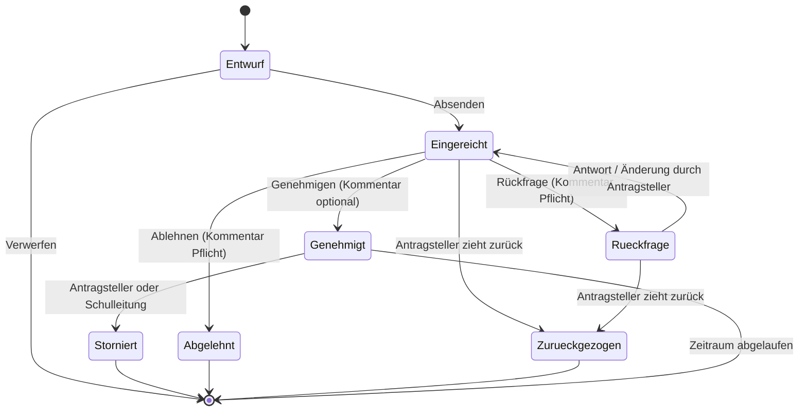

# 00 — Entscheidungsprotokoll

Laufendes Protokoll der gemeinsam getroffenen Entscheidungen. **Dieses Dokument ist
maßgeblich.** Die Dokumente 01–05 sind der ursprüngliche Entwurf mit Annahmen; sie werden
nach Abschluss der fachlichen Schritte (1–6) auf diesen Stand gebracht.

---

## Schritt 1 — Beteiligte und Rollen · *entschieden*

### E-1.1 Entscheidungsbefugnis
**Die Schulleitung entscheidet allein und standortübergreifend.** Keine Vorprüfung durch
Abteilungs- oder Standortleitungen, keine zweite Genehmigungsstufe.
→ Ein Antrag = eine Entscheidung.

### E-1.2 Vertretung der Schulleitung
**Die stellvertretende Schulleitung erhält dieselben Entscheidungsrechte**, nutzt sie aber
nur bei Abwesenheit der Schulleitung.

*Umsetzungshinweis:* Technisch ist das **eine** Rolle mit Entscheidungsrecht, die zwei
Personen innehaben. Eine Ein-/Ausschaltmechanik („Vertretungsmodus") wird bewusst **nicht**
gebaut — sie erzeugt genau dann Reibung, wenn sie gebraucht wird (die Schulleitung ist
krank und kann den Modus nicht mehr aktivieren). Stattdessen: Beide sehen den Arbeitsvorrat,
die Absprache wer entscheidet ist eine organisatorische, keine technische.

*Folge für die Übersicht:* Jeder Antrag zeigt sichtbar, **wer** entschieden hat.

### E-1.3 Vertretungs-/Stundenplanung
**Eine Person für beide Standorte.**

*Wesentliche Vereinfachung:* Damit ist der Standort für die Stundenplanung kein
Verteilkriterium, sondern nur **Inhalt** der Meldung (welche Lerngruppen an welchem Haus).
Die Standortweiche wirkt nur noch beim Sekretariat (E-1.4).

*Risiko, das dadurch entsteht:* Auch hier hängt eine Funktion an einer einzelnen Person.
Die Benachrichtigung geht deshalb an ein **Rollenpostfach**, nicht an eine persönliche
Adresse, und die Übersicht genehmigter Abwesenheiten ist auch für die Schulleitung
einsehbar — damit bei Ausfall jemand übernehmen kann.

### E-1.4 Sekretariat
**Zwei Sekretariate, je Standort eines.** Aufgabe im Workflow: **ausschließlich
Kenntnisnahme** — wissen, wer wann nicht im Haus ist (Telefon, Besucher, Auskunft).
Keine Kostenabwicklung, keine Veranstaltungsorganisation über dieses System.

*Folge — sehr geringer Datenbedarf:* Das Sekretariat erhält nur
**Name · Zeitraum · Standort · Antragsart**. Kein Anlass, keine Lerngruppen, keine Stunden,
keine Kommentare, keine Kosten. Das ist die schlankeste Sicht im ganzen System.

*Dies ist die einzige Stelle, an der die Standortauswahl den Empfängerkreis steuert.*

### E-1.5 Antragsberechtigte
**Lehrkräfte und Lehrkräfte im Vorbereitungsdienst.** Verwaltungspersonal, Hausmeisterei
und weiteres Personal bleiben zunächst im bisherigen Verfahren.

### Rollenübersicht nach Schritt 1

| Rolle | Anzahl | Standortbindung | Rechte |
|---|---|---|---|
| Antragstellende Person | alle Lehrkräfte + LiV | — | eigene Anträge stellen, ergänzen, zurückziehen, stornieren |
| Schulleitung | 1 | keine (beide Standorte) | entscheiden, alle Anträge sehen |
| Stellvertretende Schulleitung | 1 | keine | identisch — für Abwesenheitsfälle |
| Vertretungsplanung | 1 | keine (beide Standorte) | genehmigte Abwesenheiten in reduzierter Sicht |
| Sekretariat | 2 | **je Standort** | Minimalsicht, nur eigener Standort |
| Administration | 1–2 | — | Benutzer/Stammdaten, kein Zugriff auf Antragsinhalte |

### Offen aus Schritt 1 — später zu klären

* **O-1.1** Wer wickelt Reisekosten und Busbestellungen ab, wenn nicht das Sekretariat?
  Läuft das ganz außerhalb des Systems? (→ relevant in Schritt 2 bei Fortbildungen und Fahrten)
* **O-1.2** Sonderfall Vorbereitungsdienst: Bei Lehrkräften im Vorbereitungsdienst ist neben
  der Schule ggf. das Studienseminar zu beteiligen. Braucht der Workflow dafür etwas —
  oder bleibt das ein Vorgang außerhalb des Systems? (→ Schritt 4)
* **O-1.3** Wer übernimmt die Administration (Benutzerverwaltung, Stammdaten)? (→ Schritt 8)

---

## Schritt 2 — Antragsarten und Startumfang · *in Arbeit*

### E-2.1 Antragsarten im Endausbau
Bestätigt sind alle vier Arten des Entwurfs:

| Art | Bezeichnung | Kern |
|---|---|---|
| **A** | Dienstbefreiung | eine Person, persönlicher Anlass |
| **B** | Fortbildung / Dienstreise | eine Person, dienstlicher Anlass, Kostenbezug |
| **C** | Unterrichtsgang / Exkursion | Lerngruppen + Begleitpersonen, eintägig |
| **D** | Mehrtägige Fahrt / Großveranstaltung | wie C, zusätzlich Übernachtung, Kosten, Beschlusslage |

**Offen:** Die antragstellende Person hat auf ein bestehendes Dokument mit weiteren
Antragsarten verwiesen („siehe Anhang"). Das Dokument liegt noch nicht vor.
→ Liste ist bis dahin **nicht abschließend**.

### E-2.2 Startumfang Stufe 1
**Dienstbefreiung (A) + Unterrichtsgang (C).**

*Begründung:* A und C sind die beiden Gegenpole des Datenmodells — eine Person ohne
Lerngruppenbezug gegenüber ganzen Lerngruppen mit Begleitpersonen und Vertretungsbedarf.
Trägt das Konzept beide, sind B und D im Wesentlichen Varianten davon (B ≈ A mit Kosten,
D ≈ C mit Übernachtung).

*Folge für die Umsetzung:* Die Struktur für **betroffene Lerngruppen, Begleitpersonen und
Vertretungsbedarf** gehört in Stufe 1, nicht in eine Ausbaustufe. Sie nachträglich
einzuziehen wäre der teuerste denkbare Umbau.

### E-2.3 Bestehende Formulare sind Vorlage, nicht Beiwerk
An der Schule existieren **eigene, eingeführte Papierformulare**. Die digitalen Formulare
werden daran ausgerichtet: gleiche Felder, gleiche Reihenfolge, gleiche Bezeichnungen.

*Begründung:* Vertraute Formulierungen senken die Einführungshürde stärker als jede
Schulung. Abweichungen erfolgen nur mit konkretem Grund und werden einzeln begründet —
typischerweise: Pflichtfeld statt leer lassbarer Zeile, Auswahlliste statt Freitext
(Datenschutz), neue Standortauswahl.

### Offen aus Schritt 2
* **O-2.1** Bestehende Formulare liegen noch nicht vor → Feldabgleich ausstehend (Schritt 6)
* **O-2.2** Weitere Antragsarten aus dem angekündigten Dokument prüfen

---

## Schritt 2 — *abgeschlossen*

### E-2.4 Ausgangslage des vorhandenen Prototyps
* **Nur die Oberfläche existiert**, kein Backend hinter `/api/antrag`; Schulleiter-Ansicht
  und Archiv sind Platzhalter.
* Erstellt vom Auftraggeber selbst mit KI-Unterstützung; Pflege ebenfalls dort.
* Läuft bisher **nur lokal**, nicht erreichbar, **keine echten Daten**.

**Folge — der günstigste denkbare Zeitpunkt:** Anmeldung, Berechtigungen, Löschkonzept und
Datenschutzhinweis können eingebaut werden, *bevor* der erste echte Antrag existiert.
Keine Migration, keine Altdaten, kein Umbau im laufenden Betrieb.

**Folge für die Technologiewahl (Q-04):** Das System hängt an einer Person. Daraus folgt
kein Abbruch, aber ein Kriterium: **Standardtechnologie und gute Dokumentation vor
eleganter Lösung** — damit im Vertretungsfall jemand anderes übernehmen kann. Wird in
Schritt 8 als Entscheidungskriterium geführt.

---

## Schritt 3 — Standortlogik · *entschieden*

Ausgangsproblem: Im Prototyp erscheint „An beiden Standorten" nur im Zeitraum-Zweig und
kennt nur „beide" — bei einem Einzeltag ist der Standort gar nicht angebbar, und bei nicht
gesetzter Checkbox bleibt offen, *welcher* Standort gemeint ist.

### E-3.1 Form der Angabe
**Pflichtauswahl mit drei Möglichkeiten, sichtbar in beiden Zweigen** (Einzeltag *und*
Zeitraum):

```
Betroffener Standort *     ○ Runkel     ○ Villmar     ○ Beide Standorte
```

Sobald eine Anmeldung existiert, wird der Stammstandort vorbelegt — als Vorschlag,
immer änderbar.

### E-3.2 „Beide" ist bei Einzeltagen ein Regelfall, kein Sonderfall
Lehrkräfte unterrichten **regelmäßig an einem Tag an beiden Standorten**. Die Auswahl
„Beide" muss daher auch beim Einzeltag zur Verfügung stehen.

**Keine Aufteilung der Stunden je Standort.** Die Standortangabe beantwortet nur die Frage
*„in welchem Haus fehlt diese Person?"* — sie steuert damit das Sekretariat. Welche Stunde
an welchem Haus liegt, ergibt sich aus dem Stundenplan und ist der Vertretungsplanung
ohnehin bekannt. Ein zweites Stundenfeld je Standort würde das Formular verkomplizieren,
ohne eine Frage zu beantworten, die jemand tatsächlich hat.

### E-3.3 Standortangabe ist auch bei Unterrichtsgängen zwingend — *korrigiert*

> **Korrektur.** Eine frühere Fassung dieses Punktes sah vor, den Standort bei Antragsart 2
> automatisch aus den gewählten Lerngruppen abzuleiten. Das ist **nicht möglich:**
> An beiden Standorten existieren **gleichlautende Lerngruppenbezeichnungen**.

**„9b" identifiziert keine Lerngruppe.** Eindeutig ist erst das Paar
**Standort + Bezeichnung** — also `9b (Runkel)` gegenüber `9b (Villmar)`.

Daraus folgt für **alle** Antragsarten: Die Standortauswahl aus E-3.1 ist eine
**Pflichtangabe und wird nirgends abgeleitet.**

### E-3.4 Lerngruppen als Freitextfeld — *Entscheidung des Auftraggebers*

Die Lerngruppen werden **frei eingetragen**, nicht aus einer Liste gewählt.

**Begründung (maßgeblich):**
1. Mal ist eine einzelne Lerngruppe betroffen, mal mehrere — Freitext bildet beides ohne
   Umschweife ab.
2. **Eine gepflegte Lerngruppenliste müsste jedes Schuljahr angepasst werden.** Das ist
   wiederkehrender Aufwand, der bei einem von einer Person betriebenen System
   erfahrungsgemäß irgendwann unterbleibt — und eine veraltete Liste ist schlechter als
   gar keine, weil man ihr vertraut.

**Warum das tragfähig ist:** Der eigentliche Grund für eine Liste war die Verwechslung
gleichnamiger Lerngruppen beider Standorte. Dieses Problem löst bereits das **Pflichtfeld
Standort** aus E-3.1. `9b` im Freitext zusammen mit `Runkel` im Auswahlfeld ist
ebenso eindeutig wie ein Listeneintrag.

```
Betroffener Standort *   ○ Runkel   ○ Villmar   ○ Beide Standorte
Betroffene Lerngruppen * [ 9b, 10a                                      ]
                           Vorschläge erscheinen beim Tippen
```

### E-3.5 Selbstlernende Vorschläge statt gepflegter Liste

Das Feld ist Freitext, schlägt aber beim Tippen Werte vor, **die bereits in früheren
Anträgen vorkamen** (im laufenden Schuljahr, am gewählten Standort).

*Der Punkt daran:* Die Vorschlagsliste entsteht von selbst aus dem, was das Kollegium
einträgt, und veraltet von selbst mit dem Schuljahreswechsel. **Niemand pflegt sie.**
Nach wenigen Wochen wirkt sie wie eine gepflegte Lerngruppenliste, ohne je eine geworden zu
sein. Wer etwas Neues eintippt, wird nicht gehindert — Vorschlag, keine Vorschrift.

Zusätzlich beim Speichern: stille Normalisierung (Leerzeichen zusammenfassen, Trennzeichen
vereinheitlichen). **Keine Prüfung, keine Ablehnung, keine Fehlermeldung** — das Feld darf
niemanden aufhalten.

### E-3.6 Was wir dafür aufgeben

Ehrlich benannt, damit es später keine Überraschung ist:

| Entfällt | Bedeutung |
|---|---|
| Automatischer Konflikthinweis („für 9b liegt am selben Tag bereits ein Unterrichtsgang vor") | War als SOLL geplant, nicht als MUSS. Freitext lässt sich nicht zuverlässig vergleichen. |
| Auswertung nach Lerngruppen | Etwa „wie viele Unterrichtsgänge hatte die 9b". Aggregierte Kennzahlen je Antragsart und Standort bleiben möglich. |
| Einheitliche Schreibweise | `9b`, `9 b`, `9B` stehen nebeneinander. Die Normalisierung mildert das, beseitigt es nicht. |

Die Anzeigeregel bleibt bestehen: Lerngruppen werden **immer zusammen mit dem Standort**
des Antrags ausgegeben — in Übersichten, im Archiv und in Benachrichtigungen. Nie nur „9b".

### E-3.7 Sprachregelung: „Lerngruppe", nicht „Klasse"

Durchgängig in Formular, Oberfläche, Benachrichtigungen und allen Dokumenten heißt es
**Lerngruppe**.

*Grund:* „Klasse" trifft nur einen Teil der Fälle. Betroffen sind ebenso Kurse,
jahrgangsübergreifende Gruppen, Fachgruppen und Teilgruppen — die Bezeichnung muss alles
davon selbstverständlich einschließen, statt es als Sonderfall erscheinen zu lassen.

Feste Begriffe („Klassenfahrt", „Klassenkonferenz") bleiben davon unberührt.

### Wirkung der Standortangabe — Zusammenfassung

| Empfänger | Wirkt der Standort? |
|---|---|
| Schulleitung | nein — entscheidet standortübergreifend (E-1.1) |
| Vertretungsplanung | nein als Verteilkriterium — eine Zuständigkeit für beide Häuser (E-1.3); der Standort ist dort **Inhalt** und zur Unterscheidung gleichnamiger Lerngruppen unverzichtbar |
| **Sekretariat** | **ja** — bestimmt, welches der beiden Sekretariate informiert wird (E-1.4) |

Die Standortauswahl hat damit genau **einen** verteilungsrelevanten Zweck. Das ist wenig —
aber es ist der Grund, warum die Angabe eindeutig sein muss und nicht als „beide ja/nein"
genügt.

### E-3.8 Die Standorte heißen Runkel und Villmar

Im Formular, in allen Übersichten und in Benachrichtigungen werden die Standorte
**mit ihrem Ortsnamen** bezeichnet — nie als „Standort A/B", „Haupt-/Nebenstelle" oder
über ein Kürzel:

```
Betroffener Standort *   ○ Runkel   ○ Villmar   ○ Beide Standorte
```

*Warum das mehr ist als Kosmetik:* Ortsnamen sind selbsterklärend und werden im Kollegium
ohnehin verwendet. Eine künstliche Bezeichnung müsste jede neue Kollegin erst lernen, und
bei einer Auswahl, die über den Empfänger einer Benachrichtigung entscheidet, ist jede
Bedenksekunde eine Fehlerquelle.

Reihenfolge alphabetisch (Runkel vor Villmar), ohne Vorbelegung, solange es keine
Anmeldung mit Stammstandort gibt. Für die Sekretariate gilt entsprechend
„Sekretariat Runkel" und „Sekretariat Villmar".

### Schritt 3 — keine offenen Punkte

---

## Schritt 4 — Workflow und Status · *in Arbeit*

### E-4.1 Keine Fristenprüfung
An der Schule gelten **keine verbindlichen Antragsfristen**, das läuft informell.

**Folge:** Die im Entwurf vorgesehene Fristprüfung entfällt vollständig —
Anforderung **F-13 wird gestrichen**. Kein Regelvorlauf je Antragsart, kein Pflichtfeld
„Begründung der verspäteten Antragstellung", keine Warnung beim Absenden.

**Gestaltungsgrundsatz, der daraus folgt:** Das System **mahnt die antragstellende Person
nicht**. Keine roten Hinweise, kein „Sie hätten früher fragen müssen", keine Bewertung des
Zeitpunkts. Ein kurzfristiger Antrag ist ein normaler Antrag. Ob er zu spät kam,
entscheidet die Schulleitung im Einzelfall — nicht eine Regel im Formular.

**Was davon unberührt bleibt**, weil es nicht die antragstellende Person betrifft, sondern
die Entscheidung:

| Bleibt | Begründung |
|---|---|
| Arbeitsvorrat der Schulleitung **sortiert nach Beginn des Zeitraums**, nicht nach Eingang (F-08) | Was zuerst stattfindet, muss zuerst entschieden werden — unabhängig davon, wann es beantragt wurde |
| Erinnerung an die Schulleitung, wenn ein noch offener Antrag bald beginnt | Richtet sich an die Entscheidungsebene, nicht an die antragstellende Person. Verhindert, dass ein Antrag unentschieden verfällt |

Der Unterschied ist wesentlich: Es gibt keine Frist für das *Stellen* eines Antrags —
wohl aber ein Interesse daran, dass ein gestellter Antrag rechtzeitig *entschieden* wird.

### E-4.2 Kommentarpflicht bei Ablehnung — und bei Rückfrage
**Ablehnen ist ohne Begründung nicht möglich.** Der Knopf bleibt gesperrt, solange das
Kommentarfeld leer ist.

Ausgedehnt auf die **Rückfrage**: Eine Rückfrage ohne Frage ist sinnlos, also ebenfalls
Pflichttext. **Genehmigen bleibt kommentarfrei möglich** — das ist der Normalfall und soll
in einem Klick erledigt sein.

| Aktion | Kommentar |
|---|---|
| Genehmigen | optional |
| Ablehnen | **Pflicht** |
| Rückfrage | **Pflicht** |

*Folge für die Sichtbarkeit:* Eine Ablehnungsbegründung ist eine bewertende Aussage über
eine Beschäftigte oder einen Beschäftigten. Sie geht ausschließlich an die antragstellende
Person und bleibt bei der Schulleitung. **Vertretungsplanung und Sekretariat erfahren von
einem abgelehnten Antrag nichts** — auch nicht, dass es ihn gegeben hat. Informiert wird
erst ab der Genehmigung.

### E-4.3 Stornieren dürfen beide — antragstellende Person und Schulleitung
Wer zuerst erfährt, dass ein genehmigter Termin platzt, meldet es. Eine Absage ist eine
Tatsache, keine Bitte: Die Schulleitung kann einer Stornierung nicht widersprechen,
sie wird informiert.

Die Stornierung löst dieselbe Benachrichtigungskette aus wie die Genehmigung, an alle
zuvor Informierten. **Das ist die wichtigste Einzelfunktion des ganzen Systems** — eine
Abwesenheit, die doch nicht stattfindet, muss die Vertretungsplanung ebenso zuverlässig
erreichen wie die ursprüngliche Zusage.

Drei Festlegungen dazu:

* **Stornieren ist kein Löschen.** Der Vorgang bleibt mit Status *storniert* erhalten,
  einschließlich der Angabe, wer storniert hat. Ohne diese Spur bliebe unerklärlich,
  warum eine gemeldete Abwesenheit wieder verschwand.
* **Keine Begründungspflicht.** Ein geplatzter Termin muss nicht gerechtfertigt werden;
  ein optionales Feld genügt.
* **Möglich bis zum Ende des beantragten Zeitraums.** Danach nicht mehr — eine nachträgliche
  Stornierung hilft niemandem und würde die Übersicht verfälschen.

### E-4.4 Rückfrage als Dialog am Vorgang
Die Schulleitung schreibt ihre Frage, die antragstellende Person antwortet darunter.
**Alles bleibt am Vorgang sichtbar**, in einem fortlaufenden Verlauf — keine E-Mail-Kette,
kein Zurücksetzen des Antrags.

*Der entscheidende Vorteil:* Übernimmt die stellvertretende Schulleitung (E-1.2), ist der
gesamte Gesprächsstand ohne Nachfragen lesbar. Bei einer Zurückweisung zum Überarbeiten
wäre die Vorgeschichte verloren.

**Der Antrag bleibt während der Rückfrage bearbeitbar.** Viele Rückfragen laufen auf
„bitte die Stunden ergänzen" hinaus — dann soll man das Feld ändern können, statt es im
Kommentar zu beschreiben. Jede Änderung erscheint als Eintrag im selben Verlauf
(„Stunden geändert: 1–3 → 1–4"), sodass die Schulleitung sofort sieht, was passiert ist.

Kommentare sind nach dem Absenden **nicht editierbar** — ein nachträglich geänderter
Verlauf wäre wertlos. Der Verlauf ist sichtbar für die antragstellende Person und die
Entscheidungsebene, für niemanden sonst.

### E-4.5 Änderung eines genehmigten Antrags: stornieren und neu stellen
Der Entwurf sah einen eigenen Status *Geändert* mit erneuter Entscheidung vor
(Anforderung F-16). **Der entfällt.**

Stattdessen: „Antrag ändern" storniert den bestehenden Vorgang und öffnet einen neuen,
mit den Werten des alten vorbelegt. Ein Klick für die antragstellende Person, und der
neue Antrag durchläuft den gewöhnlichen Weg.

*Warum das besser ist:* Ein Status weniger, ein Sonderfall weniger in den
Benachrichtigungen — und die Vertretungsplanung bekommt zwei klare Meldungen
(„fällt weg", „kommt neu") statt einer Änderungsmeldung, die sie mit dem alten Stand
abgleichen müsste. Der Zusammenhang bleibt über einen Verweis auf den Vorgängervorgang
erhalten.

### Statusmodell nach Schritt 4



Sieben Zustände, keine Nebenwege, keine automatischen Übergänge außer dem Ablauf des
Zeitraums. **Es gibt keine Genehmigung durch Zeitablauf** — eine Genehmigung ist eine
Entscheidung, nicht das Ausbleiben einer Entscheidung.

### Schritt 4 — keine offenen Punkte

---

## Schritt 5 — Benachrichtigungen · *Vorschlag, zur Bestätigung*

### E-5.1 Vertretungsplanung: Einzelmeldung sofort — und die Liste als Arbeitsgrundlage

**Keine Tageszusammenfassung.** Jede Genehmigung und jede Stornierung erzeugt sofort eine
kurze Meldung.

*Begründung:* Eine Sammelmail löst ein Mengenproblem. Bei einer Schule dieser Größe
entstehen pro Tag einzelne, nicht dutzende Vorgänge — das Problem existiert also noch
nicht, während der Nachteil sofort wirkt: Ein um 16 Uhr genehmigter Antrag für den nächsten
Morgen darf nicht bis zum nächsten Sammellauf liegen bleiben. Sollte sich die Menge als
störend erweisen, ist eine Zusammenfassung jederzeit nachrüstbar — die umgekehrte Richtung
wäre der teurere Weg.

**Wichtiger als die Mail ist aber die Festlegung dahinter:** Die Vertretungsplanung arbeitet
**nicht aus dem Postfach**, sondern aus der Liste im System. Die E-Mail ist ein Wecker, kein
Arbeitsmittel. Eine übersehene Mail darf nie bedeuten, dass eine Vertretung fehlt — in der
Liste steht alles, auch das, was im Postfach untergegangen ist.

### E-5.2 Sekretariate: keine E-Mails, sondern eine Tagesliste

**Die Sekretariate erhalten überhaupt keine Benachrichtigungen.** Stattdessen eine jederzeit
abrufbare Ansicht *„Heute abwesend — Runkel"* bzw. *„… — Villmar"*.

*Begründung:* Der Bedarf der Sekretariate ist **tagesbezogen, nicht ereignisbezogen**
(E-1.4: Kenntnisnahme für Telefon und Besucher). Eine Mail, die am 20. April eintrifft und
eine Abwesenheit am 12. Mai ankündigt, hilft am 12. Mai niemandem — niemand durchsucht sein
Postfach, wenn das Telefon klingelt. Gebraucht wird die Antwort auf „ist die Kollegin heute
da?", und die steht in einer Liste, nicht in einem Posteingang.

**Hinzu kommt ein Datenschutzgrund, der die Entscheidung erzwingt.** Naheliegend wäre eine
Morgenmail mit den Abwesenheiten des Tages. Die enthielte aber eine **namentliche Liste
abwesender Beschäftigter** — und damit genau das, was Regel D-03 aus dem
Datenschutzkonzept ausschließt: personenbezogene Inhalte im ungesicherten Transportweg
E-Mail. Über die Zeit entstünde in den Postfächern beider Sekretariate ein
Abwesenheitsarchiv des gesamten Kollegiums, das niemand mehr löscht.

Die Liste im System löst beides zugleich: aktueller, nützlicher **und** datenschutzkonform.
Sie zeigt nur den laufenden Tag und nur den eigenen Standort.

*Nebeneffekt:* Zwei Benachrichtigungswege weniger zu bauen und zu pflegen.

### E-5.3 Eingangsbestätigung: ja

Die antragstellende Person erhält eine kurze Bestätigung per E-Mail, dass der Antrag
eingegangen ist — mit Vorgangsnummer und Link, ohne inhaltliche Angaben.

*Begründung:* Die Frage „ist das überhaupt angekommen?" ist in der Einführungsphase eines
neuen Verfahrens die häufigste. Ohne Bestätigung wird sie per Mail an die Schulleitung
gestellt — also genau der Weg, den das System ersetzen soll. Eine Zeile E-Mail verhindert
das.

### Benachrichtigungsmatrix — Stand Schritt 5

**✉** = E-Mail · **○** = im System sichtbar · **—** = keine Information

| Ereignis | Antragsteller | Schulleitung | Vertretungsplanung | Sekretariat (betroffener Standort) |
|---|---|---|---|---|
| Antrag eingereicht | ✉ Eingangsbestätigung | ✉ | — | — |
| Rückfrage gestellt | ✉ | ○ | — | — |
| Rückfrage beantwortet | ○ | ✉ | — | — |
| **Genehmigt** | ✉ | ○ | ✉ | ○ Tagesliste |
| Abgelehnt | ✉ | ○ | — | — |
| Zurückgezogen (vor Entscheidung) | ○ | ✉ | — | — |
| **Storniert** | ✉ | ✉ | ✉ | ○ Tagesliste |
| Erinnerung: offener Antrag beginnt bald | — | ✉ | — | — |

Wer storniert, bekommt darüber keine Mail — nur die jeweils andere Seite (E-4.3).

### E-5.4 Inhalt jeder E-Mail
Unverändert gültig aus dem Datenschutzkonzept: **Vorgangsnummer, Antragsart, Ereignis,
Link.** Kein Anlass, kein Kommentartext, keine Lerngruppen, keine Namen Dritter.

> Antrag DB-2026-0147 (Dienst-/Unterrichtsbefreiung) wurde genehmigt.
> Details im System: <Link>

Die einzige Ausnahme ist die Meldung an die Vertretungsplanung, die Name, Zeitraum und
Standort benötigt, um überhaupt nützlich zu sein. **Auch sie nennt keinen Anlass.**
Ob selbst das noch in eine E-Mail gehört oder besser nur als Hinweis „es gibt Neues in
der Liste" verschickt wird, ist in Schritt 7 mit dem Datenschutzbeauftragten zu prüfen.
