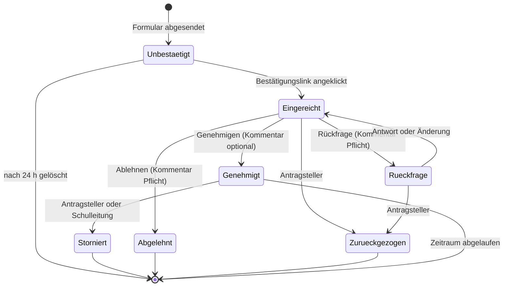

# 01 — Fachkonzept (aktueller Stand)

Beschreibt das System so, wie es nach den Schritten 1–8 beschlossen ist. Wie die
Entscheidungen zustande kamen — einschließlich der Korrekturen unterwegs — steht in
[00-entscheidungen.md](00-entscheidungen.md).

---

## 1. Was das System tut

Anträge auf **Dienst-/Unterrichtsbefreiung** und für **Unterrichtsgänge** laufen heute über
Zettel, Mail und Zuruf. Das System ersetzt das durch vier Dinge:

1. **Ein Eingang.** Jeder Antrag entsteht über ein Formular.
2. **Eine Entscheidung mit Begründung.** Genehmigen, ablehnen oder rückfragen.
3. **Automatische Weitergabe** an die Stundenplanung des betroffenen Standorts.
4. **Ein nachvollziehbarer Stand.** Sichtbar, wo ein Vorgang steht und wer entschieden hat.

### Was es ausdrücklich nicht tut

* **Keine Krankmeldungen.** Sie bleiben im bisherigen Verfahren — es sind Gesundheitsdaten.
* **Keine Arbeitszeiterfassung**, keine Abwesenheitsstatistik je Person, keine Leistungs-
  oder Verhaltenskontrolle.
* **Kein Ersatz für den Vertretungsplan.** Das System meldet einen Bedarf; geplant wird in
  Untis.
* **Keine Personalakte.** Vorgänge werden nach 12 Monaten gelöscht.
* **Keine mehrtägigen Fahrten.** Dafür fehlen Kosten, Beschlusslage und Notfallkontakt;
  sie laufen vorerst im bisherigen Verfahren.

---

## 2. Rollen

| Rolle | Anzahl | Standort | Rechte |
|---|---|---|---|
| **Antragstellende Person** | alle Lehrkräfte und LiV | — | Antrag stellen, bestätigen, ergänzen, zurückziehen, stornieren |
| **Schulleitung** | 1 | beide | entscheiden, alle Anträge sehen |
| **Stellvertretende Schulleitung** | 1 | beide | identisch — für Abwesenheitsfälle |
| **Stundenplanung** | 2 | **je Standort** | genehmigte Vorgänge des eigenen Standorts, vollständig |
| **Administration** | 1–2 | — | Konfiguration, kein fachlicher Zugriff |

Schulleitung und Stellvertretung haben **dieselbe Rolle** — kein umschaltbarer
Vertretungsmodus. Wer entschieden hat, steht am Vorgang. Über den **eigenen** Antrag
entscheidet niemand selbst.

---

## 3. Antragsarten

Beide teilen ein Formulargerüst und unterscheiden sich in drei Feldern.

### Antragsart 1 — Dienst-/Unterrichtsbefreiung
Eine Person ist abwesend. Begründung über eine Auswahl:
**Fortbildung · Dienstliche Gründe · Arztbesuch · Persönliche Gründe · Sonstiges**

*Fortbildung* verlangt entweder „Ort und Thema" oder einen Anhang.
*Persönliche Gründe* und *Sonstiges* verlangen einen kurzen Freitext.

### Antragsart 2 — Unterrichtsgang / Veranstaltung
Lerngruppen sind unterwegs. Statt der Begründung: **Ziel und Anlass**, **betroffene
Lerngruppen** und **begleitende Lehrkräfte**. Letztere werden mitgemeldet — ihre
Abwesenheit erreicht die Stundenplanung ebenso. Eine Zustimmung wird nicht eingeholt.

---

## 4. Standort

Die Schule hat zwei Standorte: **Runkel** und **Villmar**. Im Formular:

```
Betroffener Standort *     ○ Runkel     ○ Villmar     ○ Beide Standorte
```

Pflichtangabe bei beiden Antragsarten, in beiden Zweigen (Einzeltag und Zeitraum).
„Beide" ist **kein Sonderfall** — Lehrkräfte unterrichten regelmäßig an einem Tag an
beiden Häusern.

Die Angabe hat zwei Aufgaben:

* **Verteilung:** Sie bestimmt, welche der beiden Stundenplanungen die Meldung erhält.
  Bei „Beide": beide, jeweils mit dem vollständigen Vorgang.
* **Inhalt:** An beiden Standorten gibt es **gleichlautende Lerngruppenbezeichnungen**.
  „9b" allein ist mehrdeutig; erst mit dem Standort ist die Gruppe bestimmt.

Lerngruppen werden als **Freitext** erfasst, nicht aus einer Liste gewählt — eine Liste
müsste jedes Schuljahr gepflegt werden. Beim Tippen erscheinen Vorschläge aus früheren
Anträgen des laufenden Schuljahres; diese Vorschlagsliste entsteht von selbst und
veraltet von selbst.

Keine Aufteilung der Stunden je Standort: Jede Stundenplanung kennt den Plan ihres Hauses.

---

## 5. Ablauf



**Keine Fristenprüfung.** Es gibt keine verbindlichen Antragsfristen; das System bewertet
den Zeitpunkt der Antragstellung nicht und mahnt niemanden. Der Arbeitsvorrat der
Schulleitung ist nach **Beginn des Zeitraums** sortiert, nicht nach Eingang — was zuerst
stattfindet, muss zuerst entschieden werden.

**Keine Genehmigung durch Zeitablauf.** Über jeden Antrag entscheidet ein Mensch.

**Stornieren ist kein Löschen.** Der Vorgang bleibt mit Status *storniert* erhalten,
einschließlich der Angabe, wer storniert hat. Möglich bis zum Ende des Zeitraums. Die
Stornierung löst dieselbe Benachrichtigungskette aus wie die Genehmigung — **eine
Abwesenheit, die doch nicht stattfindet, muss die Stundenplanung ebenso zuverlässig
erreichen wie die Zusage.**

**Änderung eines genehmigten Antrags:** stornieren und neu stellen, mit vorbelegten Werten.
Kein eigener Status. Die Stundenplanung erhält zwei klare Meldungen statt einer
Änderungsmeldung.

**Rückfrage ist ein Dialog** am Vorgang: Die Schulleitung fragt, die antragstellende Person
antwortet darunter. Der Antrag bleibt dabei bearbeitbar; jede Änderung erscheint im selben
Verlauf („Stunden geändert: 1–3 → 1–4"). Kommentare sind nach dem Absenden nicht
editierbar. Den Verlauf sehen nur die antragstellende Person und die Entscheidungsebene.

---

## 6. Benachrichtigungen

**✉** = E-Mail · **○** = im System sichtbar · **—** = keine Information

| Ereignis | Antragsteller | Schulleitung | Stundenplanung (betroffener Standort) |
|---|---|---|---|
| Formular abgesendet | ✉ Bestätigungslink | — | — |
| Antrag bestätigt | ○ | ✉ | — |
| Rückfrage gestellt | ✉ | ○ | — |
| Rückfrage beantwortet | ○ | ✉ | — |
| **Genehmigt** | ✉ | ○ | ✉ |
| Abgelehnt | ✉ | ○ | — |
| Zurückgezogen | ○ | ✉ | — |
| **Storniert** | ✉ | ✉ | ✉ |
| Erinnerung: offener Antrag beginnt bald | — | ✉ | — |

Wer storniert, erhält darüber keine Mail — nur die jeweils andere Seite.

**Abgelehnte und zurückgezogene Anträge erreichen die Stundenplanung nicht** — auch nicht
die Information, dass es sie gab. Informiert wird erst ab der Genehmigung.

**Inhalt der E-Mails:** Vorgangsnummer, Antragsart, Ereignis, Link. Keine Begründungen,
keine Kommentartexte, keine Lerngruppen. Ausnahme ist die Meldung an die Stundenplanung,
die Name, Zeitraum und Standort enthält, um brauchbar zu sein.

**Die Stundenplanung arbeitet aus der Liste im System, nicht aus dem Postfach.** Die Mail
ist ein Wecker. Eine übersehene Mail darf nie bedeuten, dass eine Vertretung fehlt.

---

## 7. Zugang

**Für das Kollegium gibt es keine Anmeldung.** Der Link steht im Schulportal — das ist eine
Bequemlichkeit, kein Zugangsschutz: Die Anwendung bleibt über ihre Adresse erreichbar.

Stattdessen:
* Antragstellung nur mit einer Adresse der Domäne **`schule.hessen.de`**
* Der Antrag wird erst gültig, wenn der **Bestätigungslink** in der Mail angeklickt wurde.
  Vorher sieht ihn niemand; unbestätigte Anträge werden nach 24 Stunden gelöscht
* Vorgangslinks sind lange Zufallszeichenfolgen und öffnen nur den **einen** Vorgang

**Die vier Konten mit besonderen Rechten melden sich mit Passwort an** — vier getrennte
Konten, damit nachvollziehbar bleibt, wer entschieden hat, und damit die Standorttrennung
der Stundenplanungen wirkt. Die Benutzerverwaltung besteht aus vier Zeilen in der
Konfiguration. Jede Person vergibt ihr Passwort selbst.

**Was ohne Anmeldung entfällt:** keine Übersicht „Meine Anträge" — wer seinen Vorgang
ansehen oder stornieren will, braucht den Link aus der Mail. Die Bestätigung weist die
Adresse nach, nicht die Person.

---

## 8. Kennzahlen

Zulässig sind **aggregierte** Auswertungen ohne Personenbezug: Anzahl der Anträge je
Antragsart und Zeitraum, Bearbeitungsdauer, Anzahl der Unterrichtsgänge je Standort.

**Nicht zulässig** sind personenbezogene Auswertungen über den Einzelfall hinaus,
insbesondere Abwesenheitsstatistiken je Lehrkraft. Das ist keine Geschmacksfrage, sondern
Kern der Personalratsbeteiligung — und technisch auszuschließen, nicht nur zu unterlassen.
