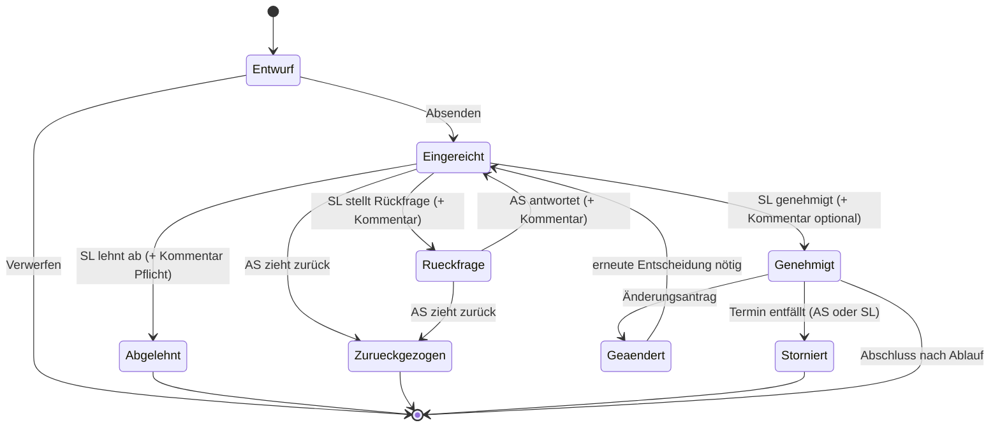

# 01 — Fachkonzept: Rollen, Antragsarten, Workflow

## 1. Zielbild

Heute laufen Anträge als Papierformular, Mail oder Zuruf. Daraus folgen die bekannten
Probleme: Anträge versanden, die Vertretungsplanung erfährt zu spät von einer genehmigten
Abwesenheit, niemand weiß, ob ein Antrag noch offen ist, und der Stand eines Vorgangs
existiert nur im Kopf der Schulleitung.

Das System löst genau vier Dinge:

1. **Ein Eingang.** Jeder Antrag entsteht über ein Formular, nicht per Mail.
2. **Eine Entscheidung mit Begründung.** Genehmigen / Ablehnen / Rückfrage, jeweils mit Kommentar.
3. **Automatische, rollengerechte Weitergabe.** Die richtigen Personen an den richtigen
   Standorten erfahren das Richtige — und nur das.
4. **Ein nachvollziehbarer Stand.** Antragsteller und Schulleitung sehen jederzeit, wo ein Vorgang steht.

### Bewusste Abgrenzung — was das System *nicht* tut

Diese Abgrenzung ist wichtig für Akzeptanz, Personalratsbeteiligung und Datenschutz:

* **Keine Krankmeldung.** Krankmeldungen bleiben im bestehenden Verfahren. Sie sind
  Gesundheitsdaten (Art. 9 DSGVO) und haben in diesem System nichts zu suchen.
* **Keine Arbeitszeiterfassung**, keine Auswertung von Abwesenheitshäufigkeiten pro Person,
  keine Ranglisten, keine Leistungs- oder Verhaltenskontrolle.
* **Kein Ersatz für den Vertretungsplan.** Das System *meldet* der Vertretungsplanung einen
  Bedarf; geplant wird weiterhin im Vertretungsplanwerkzeug.
* **Keine Personalakte.** Anträge werden nach festen Fristen gelöscht (siehe Dokument 03).

---

## 2. Rollen

| Rolle | Kürzel | Aufgabe im System |
|---|---|---|
| **Antragstellende Person** | AS | Stellt Anträge, beantwortet Rückfragen, zieht Anträge zurück. Sieht nur eigene Anträge. |
| **Schulleitung** | SL | Entscheidet: genehmigen, ablehnen, Rückfrage. Sieht alle Anträge. |
| **Vertretung der Schulleitung** | SL-V | Identische Rechte wie SL. Notwendig, damit Abwesenheit der SL keinen Stillstand erzeugt. |
| **Vertretungs-/Stundenplanung** | STP | Erhält genehmigte Abwesenheiten **ihres Standorts** in reduzierter Sicht (ohne Antragsgrund). Kein Entscheidungsrecht. |
| **Sekretariat** | SEK | Erhält genehmigte Vorgänge **seines Standorts**, soweit organisatorisch relevant (Fahrtkosten, Elterninfo, Schlüssel, Busbestellung). Kein Entscheidungsrecht. |
| **Administration** | ADM | Benutzer- und Rollenverwaltung, Stammdaten, Antragsarten, Fristen. **Kein** fachlicher Zugriff auf Antragsinhalte im Normalbetrieb. |

**Grundsatz:** Rollen werden **pro Standort** vergeben (z. B. „STP Standort A"). Eine Person
kann mehrere Rollen und mehrere Standorte haben (typisch: SL für beide Standorte,
Sekretariat nur für einen).

**Grundsatz:** Jede Person ist immer auch AS — auch die Schulleitung stellt Anträge.
Ein Antrag der SL wird nicht von ihr selbst entschieden (siehe Sonderfälle, Abschnitt 8).

---

## 3. Antragsarten

Alle Antragsarten durchlaufen **denselben Workflow** (Abschnitt 6). Sie unterscheiden sich in
drei Punkten: Formularfelder, Regelfrist, und wer nach der Genehmigung informiert wird.

| # | Antragsart | Typischer Fall | Regelfrist vor Beginn | Info nach Genehmigung an |
|---|---|---|---|---|
| **A** | **Dienstbefreiung** | Arzttermin, Umzug, familiäre Anlässe, Prüfungstermin | 5 Werktage | STP (betroffene Standorte) |
| **B** | **Dienstreise / Fortbildung** | Fortbildung, Tagung, Dienstbesprechung extern | 10 Werktage | STP, SEK (Reisekosten) |
| **C** | **Unterrichtsgang / Exkursion** | Museumsbesuch, Betriebsbesichtigung, Waldtag — eintägig, ohne Übernachtung | 10 Werktage | STP, SEK |
| **D** | **Mehrtägige Schulfahrt / Großveranstaltung** | Klassenfahrt, Studienfahrt, Schulfest, Projektwoche | 6 Wochen bzw. nach Fahrtenkonzept | STP, SEK, ggf. weitere |

Die Liste ist **konfigurierbar** — eine neue Antragsart darf keine Programmierung erfordern,
sondern nur die Definition von Feldern, Frist und Empfängerkreis.

### Unterschied C/D zu A/B — der wichtigste fachliche Punkt

Bei A und B ist **eine Person** abwesend. Bei C und D sind **Lerngruppen, Begleitpersonen und
Räume** betroffen. Ein Unterrichtsgang erzeugt also typischerweise:

* Abwesenheit der antragstellenden Lehrkraft **und aller Begleitpersonen**,
* Ausfall bzw. Verlegung des Unterrichts **für eine oder mehrere Lerngruppen**,
* freiwerdende Räume, ggf. Bus-/Raumbedarf, ggf. Mittagessen-Abmeldung.

Das Formular muss diese Angaben erheben, weil sonst die Vertretungsplanung sie
hinterherrecherchieren muss — und genau das ist der heutige Schmerzpunkt.
**Begleitpersonen müssen dem Antrag zustimmen** (siehe Abschnitt 8.3), da für sie
ebenfalls Unterricht ausfällt.

---

## 4. Standortmodell

Die Schule hat zwei Standorte. Das Konzept trennt konsequent zwei Fragen:

| Frage | Bedeutung | Wer legt es fest |
|---|---|---|
| **Stammstandort** | Wo die antragstellende Person überwiegend eingesetzt ist | Stammdaten (Administration) |
| **Betroffene Standorte** | Wo durch den Antrag Unterricht ausfällt / Organisation nötig wird | **Antragstellende Person im Formular** |

Das sind **nicht** dieselbe Angabe. Eine Lehrkraft mit Stammstandort A kann am Antragstag
ausschließlich in B unterrichten. Die Weiterleitung richtet sich **immer nach den betroffenen
Standorten**, nie nach dem Stammstandort.

### Auswahl im Formular

```
Betroffene Standorte:  ☐ Standort A    ☐ Standort B
(mindestens einer, beide möglich)
```

* Vorbelegung mit dem Stammstandort — als Vorschlag, änderbar.
* Bei **beiden** Standorten: Der Antrag wird **einmal** gestellt und **einmal** entschieden,
  aber die Folgeinformation geht an **beide** Standort-Teams (STP A *und* STP B,
  SEK A *und* SEK B).
* Bei Antragsart C/D wird die Standortangabe aus den betroffenen Lerngruppen plausibilisiert:
  Wenn eine Lerngruppe eines Standorts eingetragen ist, der nicht angehakt wurde, weist das
  System darauf hin (Hinweis, keine Blockade).

### Entscheidungszuständigkeit

**Empfehlung:** Die Entscheidung liegt **immer bei der Schulleitung, standortübergreifend**.
Ein Antrag = eine Entscheidung. Das vermeidet den Fall, dass ein Antrag an einem Standort
genehmigt und am anderen abgelehnt wird — fachlich sinnlos, da die Person nur einmal
abwesend sein kann.

Falls Abteilungs-/Standortleitungen mitentscheiden sollen, ist das als **Vorprüfung** (Empfehlung
ohne Bindungswirkung) abzubilden, nicht als zweite Genehmigungsstufe. Dieser Punkt ist in
[05-offene-fragen.md](05-offene-fragen.md) als Entscheidung markiert.

---

## 5. Statusmodell



| Status | Bedeutung | Wer kann handeln |
|---|---|---|
| **Entwurf** | Angelegt, nicht abgeschickt. Nur für AS sichtbar. | AS |
| **Eingereicht** | Liegt zur Entscheidung vor. | SL, SL-V; AS kann zurückziehen |
| **Rückfrage** | SL hat eine Frage gestellt, der Ball liegt bei AS. | AS; SL kann nachfassen |
| **Genehmigt** | Entscheidung positiv. Folgeinformationen sind raus. | AS (stornieren/ändern), SL |
| **Abgelehnt** | Entscheidung negativ, **Kommentar verpflichtend**. | — (Endzustand) |
| **Zurückgezogen** | AS hat den Antrag vor der Entscheidung zurückgenommen. | — (Endzustand) |
| **Storniert** | Genehmigter Vorgang findet nicht statt. **Auslöser für Rückmeldung an STP/SEK.** | — (Endzustand) |
| **Geändert** | Änderung an einem genehmigten Antrag; geht erneut in die Entscheidung. | SL |

**Kritisch, wird in Papierprozessen regelmäßig vergessen:** Der Übergang
*Genehmigt → Storniert*. Wenn ein Arzttermin abgesagt wird oder eine Exkursion ausfällt,
muss die Vertretungsplanung das ebenso zuverlässig erfahren wie die ursprüngliche Genehmigung.
Das System behandelt die Stornierung deshalb als vollwertiges Ereignis mit eigener
Benachrichtigung — nicht als stilles Löschen.

---

## 6. Ablauf im Detail

### 6.1 Antrag stellen (AS)

1. AS meldet sich an und wählt die Antragsart.
2. Formular ausfüllen (Felder je Antragsart, siehe [02-datenmodell.md](02-datenmodell.md)).
   Pflichtangaben in jedem Fall: Zeitraum, betroffene Standorte, Grund/Anlass,
   Angaben zur Vertretungsregelung.
3. **Fristprüfung:** Unterschreitet der Antrag die Regelfrist, erscheint ein Hinweis und
   ein Pflichtfeld „Begründung der verspäteten Antragstellung". Der Antrag wird **nicht
   blockiert** — kurzfristige Anlässe sind der Normalfall, nicht die Ausnahme.
4. **Konflikthinweis (SOLL):** Liegt für denselben Zeitraum bereits ein genehmigter Antrag
   für dieselbe Lerngruppe oder eine überschneidende Veranstaltung vor, wird darauf hingewiesen.
5. Absenden → Status *Eingereicht*, Eingangsbestätigung an AS.

### 6.2 Entscheiden (SL)

Die Schulleitung sieht eine Liste offener Anträge, sortiert nach Beginn des beantragten
Zeitraums (nicht nach Eingang — was zuerst stattfindet, muss zuerst entschieden werden).

Drei Aktionen, **jeweils mit Kommentarfeld**:

| Aktion | Kommentar | Wirkung |
|---|---|---|
| **Genehmigen** | optional | Status *Genehmigt*, Folgebenachrichtigungen werden ausgelöst |
| **Ablehnen** | **verpflichtend** | Status *Abgelehnt*, nur AS wird informiert |
| **Rückfrage** | **verpflichtend** | Status *Rückfrage*, AS wird informiert und antwortet im Vorgang |

Alle Kommentare bilden einen **Verlauf am Vorgang** (Thread), keine E-Mail-Kette. Damit ist
der Gesprächsstand auch dann vollständig, wenn die Vertretung der Schulleitung übernimmt.

**Teilgenehmigung:** Wird bewusst **nicht** unterstützt. Wenn die SL etwas anderes genehmigen
will als beantragt (z. B. nur ein Tag statt zwei), ist das eine Rückfrage — der Antrag wird
angepasst und erneut entschieden. Das hält Antrag und Genehmigung deckungsgleich.

### 6.3 Nachgelagerte Information

Erst **nach Genehmigung** erfahren STP und SEK von dem Vorgang. Vorher nicht — ein abgelehnter
oder zurückgezogener Antrag geht sie nichts an. Sie erhalten eine **reduzierte Sicht**
(siehe [02-datenmodell.md](02-datenmodell.md), Abschnitt „Sichtbarkeit").

---

## 7. Benachrichtigungsmatrix

Legende: **✉** = E-Mail-Benachrichtigung · **○** = nur im System sichtbar · **—** = keine Information

| Ereignis | AS | Begleit&shy;personen | SL / SL-V | STP (betroffene Standorte) | SEK (betroffene Standorte) |
|---|---|---|---|---|---|
| Antrag eingereicht | ✉ Eingangsbestätigung | ✉ Zustimmung erbeten (nur C/D) | ✉ | — | — |
| Rückfrage gestellt | ✉ | — | ○ | — | — |
| Rückfrage beantwortet | ○ | — | ✉ | — | — |
| **Genehmigt** | ✉ | ✉ | ○ | ✉ (reduzierte Sicht) | ✉ (nur Art B/C/D) |
| **Abgelehnt** | ✉ | ✉ | ○ | — | — |
| Zurückgezogen (vor Entscheidung) | ○ | ✉ | ✉ | — | — |
| **Storniert** (nach Genehmigung) | ✉ | ✉ | ✉ | ✉ | ✉ (sofern zuvor informiert) |
| Änderungsantrag genehmigt | ✉ | ✉ | ○ | ✉ (Delta hervorgehoben) | ✉ |
| Erinnerung: Antrag > 3 Werktage offen | — | — | ✉ | — | — |
| Erinnerung: Antrag beginnt in < 48 h, noch offen | ✉ | — | ✉ | — | — |

**Regeln, die für jede Benachrichtigung gelten:**

1. **Kein personenbezogener Inhalt in der E-Mail.** Betreff und Text nennen die Vorgangsnummer,
   die Antragsart und die Aktion — nicht den Grund, nicht Gesundheitsbezüge, nicht Freitexte.
   Beispiel: *„Antrag DB-2026-0147 (Dienstbefreiung) wurde genehmigt. Details im System: <Link>"*
   Begründung: E-Mail ist auf dem Transportweg nicht durchgängig gesichert (Details in Dokument 03).
2. **Empfängerkreis folgt den betroffenen Standorten**, nicht dem Stammstandort.
3. **Sammelbenachrichtigung (SOLL):** STP und SEK können statt Einzelmails eine
   Tageszusammenfassung wählen — mit Ausnahme von Stornierungen und Vorgängen, die innerhalb
   von 48 Stunden beginnen; die gehen immer sofort raus.
4. **Rollen-, nicht Personenadressierung.** Zugestellt wird an ein Rollenpostfach
   (z. B. `vertretungsplan-a@…`), damit Urlaub und Personalwechsel den Prozess nicht unterbrechen.

---

## 8. Sonderfälle

### 8.1 Abwesenheit der Schulleitung
SL-V hat dieselben Rechte. Zusätzlich: Ein Antrag, der länger als die konfigurierte Frist
(Vorschlag: 3 Werktage) unentschieden bleibt, erzeugt eine Erinnerung an **alle** Personen
mit Entscheidungsrecht. Es gibt **keine** automatische Genehmigung durch Zeitablauf.

### 8.2 Anträge der Schulleitung selbst
Ein Antrag darf nicht von der antragstellenden Person selbst entschieden werden. Stellt die
SL einen Antrag, ist SL-V zuständig (und umgekehrt). Das System blendet die Entscheidungs-
buttons am eigenen Antrag aus.

### 8.3 Begleitpersonen bei Unterrichtsgängen und Fahrten (Antragsart C/D)
Begleitpersonen werden im Antrag benannt und erhalten beim Einreichen eine Anfrage
(*zustimmen / ablehnen*). Erst wenn alle geantwortet haben, geht der Antrag in die
Entscheidung — oder die antragstellende Person reicht bewusst ohne vollständige Zustimmung
ein, dann ist der Stand für die SL sichtbar. Genehmigte Begleitung erzeugt für jede
Begleitperson **denselben Vertretungsbedarf** wie für die antragstellende Person.

### 8.4 Antrag betrifft beide Standorte
Ein Vorgang, eine Entscheidung, zwei Empfängerkreise (siehe Abschnitt 4). In der reduzierten
Sicht sieht jedes Standort-Team **nur die eigenen** betroffenen Lerngruppen und Stunden — nicht
die des anderen Standorts.

### 8.5 Rückwirkende Anträge
Etwa nach einem Notfall. Das System erlaubt Zeiträume in der Vergangenheit, kennzeichnet sie
als *nachträglich* und verlangt eine Begründung. Die Vertretungsplanung wird informiert,
aber mit dem Hinweis, dass die Abwesenheit bereits stattgefunden hat.

### 8.6 Serientermine
Wiederkehrende Termine (z. B. wöchentliche Fortbildung über ein Halbjahr) werden als
**ein Antrag mit mehreren Terminen** gestellt und **einmal** entschieden. Stornierung
einzelner Termine ist möglich, ohne den Gesamtantrag aufzuheben.

---

## 9. Kennzahlen — und ihre Grenze

Zulässig und sinnvoll sind **vorgangsbezogene, aggregierte** Auswertungen:
Anzahl Anträge pro Antragsart und Zeitraum, durchschnittliche Bearbeitungsdauer,
Anteil fristgerechter Anträge, Anzahl Unterrichtsgänge pro Standort.

**Nicht zulässig** sind personenbezogene Auswertungen über die Bearbeitung des Einzelfalls
hinaus — insbesondere keine Statistik „Abwesenheitstage je Lehrkraft". Das ist keine
Geschmacksfrage, sondern der Kern der Personalratsbeteiligung nach § 74 HPVG
(siehe [03-datenschutz-sicherheit.md](03-datenschutz-sicherheit.md)). Auswertungen dürfen
technisch nur in aggregierter Form existieren.
