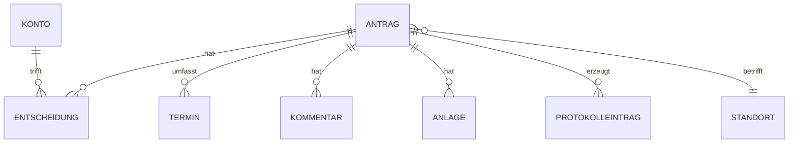

# 02 — Datenmodell und Sichtbarkeit (aktueller Stand)

Die Formularfelder im Einzelnen stehen in [07-formulare.md](07-formulare.md).
Dieses Dokument beschreibt die gespeicherten Daten und wer sie sehen darf.

---

## 1. Entitäten

**Es gibt keine Personenstammdaten.** Die antragstellende Person wird allein über ihre
dienstliche E-Mail-Adresse und den eingegebenen Namen erfasst — es gibt keine
Benutzerverwaltung für das Kollegium und keine Personenliste, die gepflegt werden müsste.

### Konto
Nur die **vier** Konten mit besonderen Rechten, als Liste in der Konfiguration:
dienstliche Adresse, Rolle (`schulleitung`, `stellvertretung`, `stundenplanung`),
bei der Stundenplanung zusätzlich der Standort. Dazu der Passwort-Hash (Argon2id oder
bcrypt), der **nicht** in der Konfigurationsdatei, sondern in der Datenbank liegt.

### Antrag
| Feld | Bemerkung |
|---|---|
| Vorgangsnummer | z. B. `DB-2026-0147` — erscheint in jeder E-Mail |
| Antragsart | 1 oder 2 |
| Name, dienstliche E-Mail-Adresse | aus dem Formular |
| Status | acht Zustände einschließlich *unbestätigt* |
| Betroffener Standort | Runkel · Villmar · Beide |
| Zeitraum | Einzeltag (mit Stunden/ganztägig) oder Von–Bis |
| Pausenaufsichten | Freitext |
| Begründungskategorie *(Art. 1)* | eine von fünf |
| Detailtext *(Art. 1)* | begrenzt auf ca. 200 Zeichen |
| Ziel und Anlass *(Art. 2)* | Freitext |
| Lerngruppen *(Art. 2)* | Freitext mit Vorschlägen |
| Begleitende Lehrkräfte *(Art. 2)* | Freitext, mehrere |
| Unterlagen für die Vertretung | eine von drei Möglichkeiten |
| Anmerkungen | optional |
| Bestätigungsschlüssel, Vorgangsschlüssel | lange Zufallszeichenfolgen |
| Eingereicht am, bestätigt am | Zeitstempel |
| Löschdatum | 12 Monate nach Ende des Zeitraums |

### Kommentar
Verfasser, Zeitpunkt, Text. **Nach dem Absenden nicht editierbar** — ein nachträglich
geänderter Verlauf wäre wertlos. Änderungen am Antrag während einer Rückfrage erscheinen
als Einträge im selben Verlauf.

### Entscheidung
Konto, Zeitpunkt, Ergebnis, Kommentar. Bei Ablehnung und Rückfrage ist der Kommentar
Pflicht, bei Genehmigung optional.

### Anlage
Datei zum Vorgang. Kein Attest-Upload — das Formular weist ausdrücklich darauf hin.
Ablage außerhalb des Web-Verzeichnisses, Auslieferung nur berechtigungsgeprüft und
immer als Download. Löschung gemeinsam mit dem Vorgang.

### Protokolleintrag
Anmeldungen, Statusänderungen, Zugriffe, Löschläufe. **Getrennt von den Fachdaten**,
Löschung nach 6 Monaten, zugänglich nur für Administration und Datenschutzbeauftragte —
ausdrücklich **nicht** als Führungsinstrument.

---

## 2. Sichtbarkeit

**●** sichtbar · **◐** eingeschränkt · **○** nicht sichtbar

| Angabe | Antragsteller (über Link) | Schulleitung / Stellvertretung | Stundenplanung (betroffener Standort) | Administration |
|---|---|---|---|---|
| Alle Formularangaben einschließlich Freitext | ● | ● | ● | ○ |
| Anlagen | ● | ● | ● | ○ |
| Entscheidung und Entscheidungskommentar | ● | ● | ● | ○ |
| **Rückfrage-Dialog** | ● | ● | **○** | ○ |
| Anträge vor der Genehmigung | ● (eigene) | ● | **○** | ○ |
| Abgelehnte / zurückgezogene Anträge | ● (eigene) | ● | **○** | ○ |
| Vorgänge des **anderen** Standorts | — | ● | ○ | ○ |
| Standortübergreifende Vorgänge | ● | ● | ● **vollständig** | ○ |
| Protokolleinträge | ○ | ○ | ○ | ● |

### Warum die Stundenplanung alles sieht

Die Stundenplanung erhält **dieselben Antragsinhalte wie die Schulleitung** — das
entspricht dem bisherigen Verfahren und wird für die Kommunikation mit den Kolleginnen
und Kollegen benötigt. Hinzu kommt: Untis verlangt beim Eintragen einer Abwesenheit einen
Absenzgrund.

Es bleiben drei Grenzen, die nichts mit dem Antragsinhalt zu tun haben:
**erst ab Genehmigung**, **nur der eigene Standort**, **kein Rückfrage-Dialog**.

**Der Kreis der Mitwissenden umfasst damit vier Personen**, alle mit dienstlicher Funktion
im Vorgang. Da die Zugriffsbeschränkung wenig trägt, liegt das Gewicht des Datenschutzes
auf der **Löschfrist** (12 Monate), dem **Hinweis am Freitextfeld** und der
**Zweckbindung in der Dienstvereinbarung** — siehe
[08-datenschutz-umsetzung.md](08-datenschutz-umsetzung.md).

---

## 3. Schnittstellen

| Schnittstelle | Stufe |
|---|---|
| **E-Mail-Versand** (SMTP, mit SPF und DKIM) | **1 — zwingend** |
| Anmeldung über Schulportal oder IServ | später möglich, nicht vorausgesetzt |
| Übergabe an Untis | Stufe 3; vorerst trägt die Stundenplanung von Hand ein |
| Kalenderexport | offen |

**Abzustimmen:** Die fünf Begründungskategorien sollten mit den **Absenzgründen in Untis**
übereinstimmen, damit die Stundenplanung sie unverändert übernehmen kann, statt sie bei
jedem Vorgang zu übersetzen.
