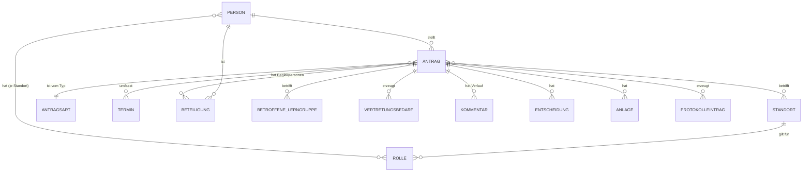

# 02 — Datenmodell und Formularfelder

Dieses Dokument beschreibt **welche Daten** erhoben werden und **wer sie sehen darf**.
Beides gehört zusammen: Die Feldsichtbarkeit ist der wirksamste Datenschutz im ganzen System.

---

## 1. Entitäten (Überblick)



### 1.1 Person
Beschäftigte der Schule. Stammdaten kommen aus der vorhandenen Quelle (Personalliste /
Verzeichnisdienst), werden **nicht** im System gepflegt.

| Feld | Zweck |
|---|---|
| Personen-ID | interner Schlüssel |
| Nachname, Vorname | Anzeige |
| Dienstliche E-Mail | Benachrichtigung, Anmeldung |
| Kürzel | Abgleich mit Vertretungsplan |
| Stammstandort | Vorbelegung im Formular |
| Aktiv ja/nein | Ausgeschiedene Personen können keine Anträge stellen |

Bewusst **nicht** erhoben: Privatanschrift, private Telefonnummer, Geburtsdatum,
Beschäftigungsumfang, Besoldungsgruppe, Schwerbehinderteneigenschaft. Nichts davon wird
für den Workflow gebraucht.

### 1.2 Standort
| Feld | Zweck |
|---|---|
| Standort-ID, Bezeichnung, Kürzel | Auswahl im Formular |
| Rollenpostfächer (STP, SEK) | Zustellung der Benachrichtigungen |

### 1.3 Rolle
Zuordnung *Person × Rolle × Standort*. Eine Person kann `STP` für Standort A und
gleichzeitig `AS` überall sein. SL wird in der Regel ohne Standortbindung vergeben.

### 1.4 Antragsart
Konfigurierbar, kein Code: Bezeichnung, Feldsatz, Regelfrist, Empfängerkreis nach
Genehmigung, Anlagen erforderlich ja/nein, Aufbewahrungsfrist.

### 1.5 Antrag (Kernentität)
| Feld | Typ | Bemerkung |
|---|---|---|
| Vorgangsnummer | z. B. `DB-2026-0147` | fachlicher Schlüssel, in allen Mails |
| Antragsart | Referenz | |
| Antragsteller | Referenz Person | |
| Status | siehe Statusmodell | |
| Betroffene Standorte | 1..2 | **vom Antragsteller gewählt** |
| Eingereicht am | Zeitstempel | |
| Fristunterschreitung | ja/nein + Begründung | automatisch berechnet |
| Nachträglich | ja/nein | Zeitraum liegt in der Vergangenheit |

### 1.6 Termin
Ein Antrag hat 1..n Termine (Serientermine). Je Termin: Datum, Beginn, Ende oder
„ganztägig", betroffene Unterrichtsstunden (z. B. 3.–6. Stunde), Status
(geplant / storniert).

### 1.7 Vertretungsbedarf
Pro Termin und betroffener Person/Lerngruppe: Lerngruppe, Fach, Stunde, Raum,
Regelungsvorschlag (`Aufgaben hinterlegt` / `Tausch mit …` / `Vertretung erforderlich` /
`entfällt ersatzlos`). **Das ist das Datenpaket, das die Vertretungsplanung tatsächlich braucht.**

### 1.8 Kommentar
Autor, Zeitpunkt, Text, Sichtbarkeit (`alle Beteiligten` / `nur Entscheidungsebene`).
Kommentare sind nach dem Absenden nicht editierbar — sonst ist der Verlauf wertlos.

### 1.9 Entscheidung
Entscheidende Person, Zeitpunkt, Ergebnis, Kommentar. Bei Änderungsanträgen entstehen
mehrere Entscheidungen zu einem Vorgang; alle bleiben erhalten.

### 1.10 Anlage
Datei zum Vorgang (z. B. Einladung zur Fortbildung, Elterninformation, Fahrtenkonzept).
Anlagen erben die Sichtbarkeit des Antrags und werden mit ihm gelöscht. **Keine**
Attestupload-Funktion — das wäre ein Gesundheitsdatum (siehe Dokument 03).

### 1.11 Protokolleintrag
Technisches Protokoll: Wer hat wann welche Statusänderung ausgelöst, welcher Zugriff auf
welchen Vorgang. Getrennt von den Fachdaten, eigene Aufbewahrungsfrist, nur für ADM und
Datenschutzbeauftragte einsehbar, **nicht** für die Schulleitung als Führungsinstrument.

---

## 2. Formularfelder je Antragsart

### Gemeinsamer Kern (alle Antragsarten)

| Feld | Pflicht | Hinweis |
|---|---|---|
| Antragsart | ✓ | |
| Zeitraum / Termine | ✓ | Datum + Uhrzeit oder Stundenangabe |
| **Betroffene Standorte** | ✓ | A / B / beide |
| Betroffene Unterrichtsstunden | ✓ | Auch „keine" ist eine gültige Angabe |
| Vertretungsregelung | ✓ | Auswahl + Freitext |
| Anmerkungen | — | Freitext |

### A — Dienstbefreiung

| Feld | Pflicht | Hinweis |
|---|---|---|
| Anlass | ✓ | **Auswahlliste**, kein Freitext-Zwang: Arzt-/Behördentermin · familiärer Anlass · Umzug · Prüfung/Studium · Ehrenamt · Sonstiges |
| Ergänzung zum Anlass | nur bei „Sonstiges" | Freitext, kurz |
| Nachweis vorhanden | — | ja/nein — **ohne Upload und ohne Inhaltsangabe** |

**Fachlich wichtig:** Die Auswahlliste ist das entscheidende Datenschutzmerkmal dieses
Formulars. „Arzttermin" ist eine Terminangabe. Ein Freitextfeld verleitet dazu,
Diagnosen, Angehörigen- oder Trauerfälle hineinzuschreiben — und damit besondere
Kategorien personenbezogener Daten nach Art. 9 DSGVO zu erzeugen, für die deutlich
schärfere Anforderungen gelten. Das Formular führt deshalb aktiv von Freitext weg und
trägt einen sichtbaren Hinweis: *„Bitte keine Angaben zu Gesundheit, Diagnosen oder
Angehörigen. Für die Entscheidung genügt der Anlass."*

### B — Dienstreise / Fortbildung

Kern + Anlass/Veranstaltung, Veranstalter, Ort, Reisekosten beantragt (ja/nein),
voraussichtliche Kosten, Kostenträger, Anlage (Einladung/Programm).

### C — Unterrichtsgang / Exkursion

Kern + Ziel/Anlass, Bildungsplanbezug, **betroffene Lerngruppen** (mit Standort),
Anzahl Schülerinnen und Schüler, **Begleitpersonen**, Treffpunkt/Rückkehr,
Beförderung (zu Fuß / ÖPNV / Bus / privat), Kosten für SuS, Aufsichtsregelung,
Elterninformation erfolgt (ja/nein).

### D — Mehrtägige Fahrt / Großveranstaltung

Wie C, zusätzlich: Übernachtungen, Unterkunft, Gesamtkosten und Finanzierung,
Beschlusslage (Klassen-/Schulkonferenz), Begleitpersonenschlüssel,
Notfallkontakt vor Ort, Rückkehrzeitpunkt, benötigte Ressourcen (Räume, Busse, Schlüssel).

---

## 3. Sichtbarkeit auf Feldebene

Dies ist die zentrale Tabelle für die spätere technische Umsetzung. Die Berechtigung wirkt
**pro Feld**, nicht nur pro Vorgang.

Legende: **●** sichtbar · **◐** sichtbar in reduzierter Form · **○** nicht sichtbar

| Feld / Feldgruppe | AS (eigene) | SL / SL-V | STP (betroffener Standort) | SEK (betroffener Standort) | ADM |
|---|---|---|---|---|---|
| Vorgangsnummer, Antragsart, Status | ● | ● | ● | ● | ● |
| Name der antragstellenden Person | ● | ● | ● | ● | ○ |
| Zeitraum / Termine | ● | ● | ● | ● | ○ |
| Betroffene Standorte | ● | ● | ● | ● | ○ |
| **Anlass der Dienstbefreiung (Art A)** | ● | ● | **○** | **○** | ○ |
| Ergänzung / Freitext zum Anlass | ● | ● | ○ | ○ | ○ |
| Betroffene Stunden / Lerngruppen / Räume | ● | ● | ● | ◐ nur wenn organisatorisch nötig | ○ |
| Vertretungsregelung | ● | ● | ● | ○ | ○ |
| Begleitpersonen | ● | ● | ● | ● | ○ |
| Kosten, Reisekosten, Finanzierung | ● | ● | ○ | ● | ○ |
| Kommentarverlauf | ● | ● | ○ | ○ | ○ |
| Entscheidung + Entscheidungskommentar | ● | ● | ◐ nur Ergebnis | ◐ nur Ergebnis | ○ |
| Anlagen | ● | ● | ○ | ◐ nur kostenrelevante | ○ |
| Protokolleinträge | ○ | ○ | ○ | ○ | ● |

### Die reduzierte Sicht der Vertretungsplanung

Was die Vertretungsplanung tatsächlich zu sehen bekommt:

```
DB-2026-0147 · Dienstbefreiung · GENEHMIGT
Person:     Müller, A. (Kürzel MÜL)
Standort:   A
Zeitraum:   Di, 12.05.2026, 3.–6. Stunde
Betroffen:  9b (Mathematik, Raum A-204) · 10a (Mathematik, Raum A-112)
Regelung:   Aufgaben hinterlegt (Ablage im Lehrerzimmer)
```

Kein Anlass, kein Kommentar, keine Begründung. Für die Vertretungsplanung ist
die Ursache der Abwesenheit ohne Belang — sie plant den Ausfall, nicht den Menschen.
Genau diese Trennung fehlt im heutigen E-Mail-Verfahren, in dem eine weitergeleitete
Mail regelmäßig den vollständigen Antragstext mitträgt.

---

## 4. Schnittstellen (Prüfpunkte für die Umsetzungsphase)

| Schnittstelle | Richtung | Zweck | Priorität |
|---|---|---|---|
| Verzeichnisdienst / Schulportal (SSO) | ein | Anmeldung, Personenstammdaten | hoch |
| E-Mail (SMTP) | aus | Benachrichtigungen | hoch (MUSS) |
| Vertretungsplanwerkzeug (z. B. Untis) | aus | Export genehmigter Abwesenheiten | mittel — zunächst manuell, Import per Datei/CSV als Zwischenschritt |
| Kalender (ICS) | aus | Veranstaltungen im Schulkalender | niedrig |
| Raum-/Ressourcenbuchung | aus | Räume, Busse | niedrig |

**Empfehlung für Stufe 1:** Nur SSO und E-Mail. Die Vertretungsplanung erhält zunächst
eine strukturierte Liste im System plus Benachrichtigung; die automatische Übergabe an
das Planungswerkzeug ist Stufe 2. Grund: Eine Kopplung an Untis & Co. ist erfahrungsgemäß
der aufwändigste und fehleranfälligste Teil — sie darf den Nutzen der übrigen 90 % nicht
verzögern.
